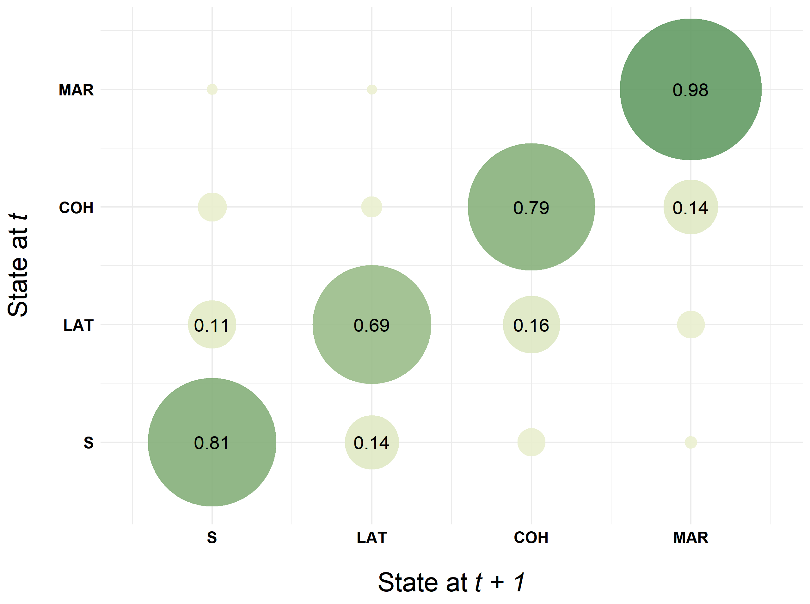
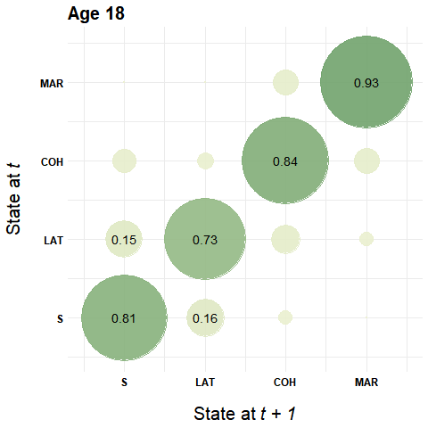

```{r setup, include=FALSE}
knitr::opts_chunk$set(echo = FALSE)

options("kableExtra.html.bsTable" = T)

load("Test.RData")

# ******************************************************************************
# ******************************************************************************

# ===================================================
# Load and download (if necessary) required packages
# ===================================================

# use (and install if necessary) pacman package 
if (!require("pacman")) install.packages("pacman")
library(pacman)

# load and install (if necessary) required packages for this course
p_load(TraMineR, TraMineRextras, tidyverse, haven, Hmisc,
       RColorBrewer, colorspace, knitr, kableExtra, reshape2)


# ******************************************************************************

# extracting and recoding the sequence variables (which all start with state)
# recode to reduced state space capturing partnership status only 

seqvars <- family %>%
  select(starts_with("state")) %>%
  mutate_all(list(~case_when(
    . < 3 ~ 1,            # Single
    . %in% c(3,4) ~ 2,    # LAT
    . %in% c(5,6) ~ 3,    # Cohabiting
    . > 6 ~ 4,)))         # Married


# ******************************************************************************

# Defining the labels
shortlab <- c("S", "LAT", "COH", "MAR")
longlab <-  c("Single", "LAT", "Cohabiting", "Married")


# ******************************************************************************

# Choosing colors with the pre-defined color palettes of colorspace
colspace <- sequential_hcl(4, palette = "Heat", rev = TRUE)


# ******************************************************************************


# define sequence object using monthly data
fam.month.seq <- seqdef(seqvars, 
                        states = shortlab, labels = longlab, alphabet = c(1:4),  
                        cpal = colspace,
                        weights = family$weight40,
                        id = family$id,
                        xtstep = 24)


# change granularity --> years instead of months (using modal values)
fam.year.seq <- seqgranularity(fam.month.seq, 
                               tspan=12, 
                               method="mostfreq")

fam.year.eseq <- seqecreate(fam.year.seq, use.labels = FALSE)

# ******************************************************************************

# mean time spent in each state

statemeandur <- as_tibble(round(seqmeant(fam.month.seq, serr = TRUE)[,c(1,3)],1), 
                          rownames = "State")

statemeandur <- statemeandur %>%
  mutate(reltime = round(seqmeant(fam.month.seq, prop = TRUE),2))


# ******************************************************************************

# mean no of episodes by state

sum_episodes <- as_tibble(round(seqmeant(seqdss(fam.month.seq), 
                                         serr = TRUE)[,c(1,3)],1),
                          rownames = "State") %>%
  rename(ep_Mean = 2, ep_SD = 3)

table1 <- statemeandur %>% inner_join(sum_episodes)


# ******************************************************************************
# ******************************************************************************


# State distribution at specific dates
 
statedis <- seqstatd(fam.month.seq)$Frequencies

statedis2 <- as_tibble(round(statedis[,c(1, seq(24, 264, by = 48))],2),
                       rownames = "State")


# ******************************************************************************

# Transition matrix

transmat <- seqtrate(fam.year.seq)

rownames(transmat) <- shortlab
colnames(transmat) <- shortlab


transmat.tbl <- as_tibble(round(transmat,2),
                          rownames = "Origin")


# ******************************************************************************  
# ******************************************************************************

# Number of tranistions

# monthly
m1 <- round(wtd.mean(seqtransn(fam.month.seq), family$weight40),1)
m2 <- round(sqrt(wtd.var(seqtransn(fam.month.seq), family$weight40)),1)

# yearly
y1 <- round(wtd.mean(seqtransn(fam.year.seq), family$weight40),1)
y2 <- round(sqrt(wtd.var(seqtransn(fam.year.seq), family$weight40)),1)


transfreq <- tibble(Granularity = c("Monthly data", "Yearly data"), 
                    Mean = c(m1, y1), 
                    SD = c(m2, y2))


# ******************************************************************************


```

We use a simple alphabet differentiating four partnership states to illustrate `TraMineR`'s capabilities of producing simple descriptive statistics on our sequence data. The sequences cover the partnership biographies from age 18 to 40 (monthly data).
The sequences are stored in the object `fam.month.seq`.


```{r echo=FALSE}
kable(tibble(state = longlab, shortlabel = shortlab), 
      col.names = c("State", "Short Label")) %>%
  kable_styling(bootstrap_options = 
                  c("responsive", "hover", "condensed"),
                full_width = F)
```


\  


## Time spent in different states & <br/>occurence of episodes 

The function `seqmeant` computes the mean total time spent in each state of the alphabet. The arguments `serr = TRUE` and `prop = TRUE` provide standard errors and relative frequencies instead of the average number of months spent in each state.


```{r, eval=FALSE, echo=TRUE}
seqmeant(fam.month.seq, serr = TRUE)
seqmeant(fam.month.seq, prop = TRUE)
```

We also can use `seqmeant` to identify the average number of episodes for each state of the alphabet by applying it to a sequence data object in the **DSS** format.

```{r, eval=FALSE, echo=TRUE}
seqmeant(seqdss(fam.month.seq),serr = TRUE)
```


```{r, echo=FALSE}

kable(table1,
      col.names = c("State", "Mean", "SD", "relative freq.", "Mean", "SD")) %>%
  add_header_above(c(" ", "Time spent in months" = 3, "Number of episodes" = 2)) %>%
  kable_styling(bootstrap_options = 
                  c("responsive", "hover", "condensed"),
                full_width = F)

```


## State distribution at different positions <br/>(cross-sectional perspective)

Among other things `seqstatd` computes the distribution of states at each position in the sequence. Usually this information is displayed in a graphical fashion (state distribution plot) rather than as a descriptive table.

Usually the tabular presentation of the state distribution requires to extract the distribution for a selection of (meaningful) positions of the sequence. In the example below we display the distribution at age 18, 20, 24, 28, 32, 36, and 40. Note that time is measured in months. Hence, we do not extract the descriptives at positions 1 and 3 but at positions 1 and 24 to obtain the state distribution at age 18 and 20. 

```{r, eval=FALSE, echo=TRUE}
seqstatd(fam.month.seq)$Frequencies[,c(1, seq(24, 264, by = 48))]
```

```{r, echo=FALSE}
kable(statedis2,
      col.names = c("State", 18, seq(20,40, by = 4))) %>%
  add_header_above(c(" ", "Age" = 7)) %>%
  kable_styling(bootstrap_options = 
                  c("responsive", "hover", "condensed"),
                full_width = F)
```

The distribution above  indicates the dominance of the partnership states "Single" and "Married" at the beginning and ending of the sequence. This is also reflected in the sequence of modal states. 

```{r, echo=TRUE}
modal.seq <- seqdef(as_tibble(seqmodst(fam.month.seq)))
print(modal.seq, format = "SPS")
```


## Number of transitions & transition matrix

The person-specific number of transitions between states can be obtained by `seqtransn`. However, we are usually interested in the average number of transitions. We use `wtd.mean` and `wtd.var` from the `Hmisc` package to compute the weighted mean and standard deviation. The weights are stored in the variable `weight40` of the data frame `family` which served as source for generating the sequence object `fam.month.seq`.

```{r, eval=FALSE, echo=TRUE}
wtd.mean(seqtransn(fam.month.seq), family$weight40)
sqrt(wtd.var(seqtransn(fam.month.seq), family$weight40))
```

We did the computation for the sequence object `fam.year.seq` which comes with a *yearly* instead of a *monthly granularity* (see chapter 2.2).

```{r, echo=FALSE}
kable(transfreq) %>%
  kable_styling(bootstrap_options = 
                  c("responsive", "hover", "condensed"),
                full_width = F) 
```


Transition rates between states can be computed by using `seqtrate`. In most applications sequence data with a high granularity - such as monthly partnership biographies - yield a modest share of transitions between different states. Hence, we illustrate the transitions rates using sequences with yearly partnership information from age 18-40 (`fam.year.seq`). This reduces sequence length from 264 to 22. If you are interested in transitions rates at specific positions of the sequence you can specify `time.varying = TRUE`.


```{r, eval=FALSE, echo=TRUE}
seqtrate(fam.year.seq)
```

```{r, echo=FALSE}

transmat.tbl %>%
  mutate(Origin = cell_spec(Origin, bold = TRUE, color = "black")) %>%
  kable(col.names = c("State at t", "S", "LAT", "COH", "MAR"),
        escape = FALSE) %>%
  add_header_above(c(" ", "State at t+1" = 4)) %>%
  kable_styling(bootstrap_options = 
                  c("responsive", "hover", "condensed"),
                full_width = F) 
```

### Additional material: <br/>Graphical illustration of transition rates

Chapter 2.3.1 of the book is restricted to the tabular description of sequence data. TraMineR's plot functions are presented in Chapter 2.3.2
In addition to this material, we use this page to illustrate how to visualize transition rates using `ggplot2` and `gganimate`.


```{r, eval=FALSE, echo=TRUE}

# Transform transition rates into tibble
transmat <- seqtrate(fam.year.seq)
rownames(transmat) <- c(1, 2, 3, 4)
colnames(transmat) <- c(1, 2, 3, 4)
seqtrate_df <- as_tibble(melt(transmat))


# Plot transition rates using ggplot
seqtrate_df %>%
  ggplot(aes(x = Var2, y = Var1)) + 
  geom_point(aes(color = value, size = value), alpha = .9) +
  scale_color_continuous_sequential(palette = "Green-Yellow", 
                                    begin = 0.2, end = 0.8) +
  scale_size(range = c(0, 50)) + 
  geom_text(data = filter(seqtrate_df, value>.10), 
            aes(label=round(value, 2)), size = 5) +
  theme_minimal() +
  theme(legend.position = "none",
        axis.text = element_text(color = "black", 
                                 size = 12, face = "bold"),
        axis.title = element_text(color = "black", 
                                  size = 20, face = "bold"),
        axis.title.y = element_text(margin = margin(0, 20, 0, 0)),
        axis.title.x = element_text(margin = margin(20, 0, 0, 0))) +
  scale_x_continuous(name=expression('State at'~italic("t + 1")), 
                     breaks=c(1,2,3,4), 
                     labels=c("S", "LAT", "COH", "MAR"), 
                     limits=c(0.5, 4.5)) +
  scale_y_continuous(name=expression('State at'~italic("t")),
                     breaks=c(1,2,3,4), 
                     labels=c("S", "LAT", "COH", "MAR"), 
                     limits=c(0.5, 4.5))

```

\  


<div class="lightbox"> 
  <p align="center">
  {width=80%}
  </p>
</div>


With the following code we can generate an animated illustration of time varying transitions rates.


```{r, eval=FALSE, echo=TRUE}
# Transform array with time varying transition rates into tibble
tratesvar <- seqtrate(fam.year.seq, time.varying = TRUE)
rownames(tratesvar) <- c(1, 2, 3, 4)
colnames(tratesvar) <- c(1, 2, 3, 4)

tratesvar <- as_tibble(melt(tratesvar)) %>%
  mutate(Var3 = as.numeric(Var3) + 17,
         value = round(value, 2))


# Use ggplot and gganimate to generate animated illustration
p <- tratesvar %>%
  ggplot(aes(x = Var2, y = Var1)) + 
  geom_point(aes(color = value, size = value), alpha = .9) +
  scale_color_continuous_sequential(palette = "Green-Yellow", 
                                    begin = 0.2, end = 0.8) +
  scale_size(range = c(0, 50)) + 
  geom_text(data = filter(tratesvar, value>.10), 
            aes(label=value), size = 5) +
  theme_minimal() +
  theme(legend.position = "none",
        axis.text = element_text(color = "black",
                                 size = 12, face = "bold"),
        axis.title = element_text(color = "black", 
                                  size = 20, face = "bold"),
        axis.title.y = element_text(margin = margin(0, 20, 0, 0)),
        axis.title.x = element_text(margin = margin(20,0, 0, 0)),
        plot.title = element_text(size = 20, face = "bold")) +
  scale_x_continuous(name=expression('State at'~italic("t + 1")), 
                     breaks=c(1,2,3,4), 
                     labels=c("S", "LAT", "COH", "MAR"), 
                     limits=c(0.5, 4.5)) +
  scale_y_continuous(name=expression('State at'~italic("t")), 
                     breaks=c(1,2,3,4), 
                     labels=c("S", "LAT", "COH", "MAR"), 
                     limits=c(0.5, 4.5)) +
  transition_states(Var3) +
  ggtitle('Age {closest_state}')

anim <- animate(p, nframes = 21, duration = 10.5)
```

\  

<div class="lightbox"> 
  <p align="center">
  {width=70%}
  </p>
</div>


<script type="text/javascript" src="lightbox.js"></script>

