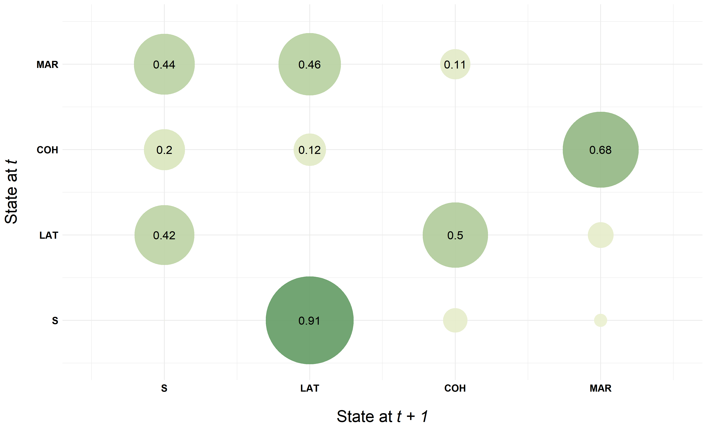
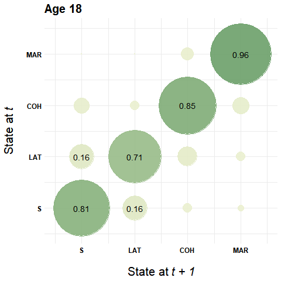

```{r setup, include=FALSE}
knitr::opts_chunk$set(echo = FALSE)

options("kableExtra.html.bsTable" = T)

# load data required for this subchapter
load("2-3-1_BasicDescription.RData")

# (down)load required packages using pacman
source("0-0_LoadInstallPackages.R")

```

We use a simple alphabet differentiating four partnership states to illustrate `TraMineR`'s capabilities of producing simple descriptive statistics on our sequence data. The sequences cover the partnership biographies from age 18 to 40 (monthly data).
The sequences are stored in the object `partner.month.seq`.


```{r echo=FALSE}
kable(tibble(state = longlab.partner, shortlabel = shortlab.partner), 
      col.names = c("State", "Short Label")) %>%
  kable_styling(bootstrap_options = 
                  c("responsive", "hover", "condensed"),
                full_width = F)
```


\  


## Time spent in different states & <br/>occurence of episodes 

The function `seqmeant` computes the mean total time spent in each state of the alphabet. The arguments `serr = TRUE` and `prop = TRUE` provide standard errors and relative frequencies instead of the average number of months spent in each state.


```{r, eval=FALSE, echo=TRUE}
seqmeant(partner.month.seq, serr = TRUE)
seqmeant(partner.month.seq, prop = TRUE)
```

We also can use `seqmeant` to identify the average number of episodes for each state of the alphabet by applying it to a sequence data object in the **DSS** format.

```{r, eval=FALSE, echo=TRUE}
seqmeant(seqdss(partner.month.seq),serr = TRUE)
```


```{r, echo=FALSE}

kable(table1,
      col.names = c("State", "Mean", "SD", "relative freq.", "Mean", "SD")) %>%
  add_header_above(c(" ", "Time spent in months" = 3, "Number of episodes" = 2)) %>%
  kable_styling(bootstrap_options = 
                  c("responsive", "hover", "condensed"),
                full_width = F)

```


## State distribution at different positions <br/>(cross-sectional perspective)

Among other things `seqstatd` computes the distribution of states at each position in the sequence. Usually this information is displayed in a graphical fashion (state distribution plot) rather than as a descriptive table.

Usually the tabular presentation of the state distribution requires to extract the distribution for a selection of (meaningful) positions of the sequence. In the example below we display the distribution at age 18, 20, 24, 28, 32, 36, and 40. Note that time is measured in months. Hence, we do not extract the descriptives at positions 1 and 3 but at positions 1 and 24 to obtain the state distribution at age 18 and 20. 

```{r, eval=FALSE, echo=TRUE}
seqstatd(partner.month.seq)$Frequencies[,c(1, seq(24, 264, by = 48))]
```

```{r, echo=FALSE}
kable(statedis2,
      col.names = c("State", 18, seq(20,40, by = 4))) %>%
  add_header_above(c(" ", "Age" = 7)) %>%
  kable_styling(bootstrap_options = 
                  c("responsive", "hover", "condensed"),
                full_width = F)
```

## Modal and representative sequences

The distribution above  indicates the dominance of the partnership states "Single" and "Married" at the beginning and ending of the sequence. This is also reflected in the sequence of modal states. The following commands extract the modal sequences using sequence data with monthly and yearly granularity (see chapter 2.2).

```{r, echo=TRUE, eval=FALSE}
modal.month.seq <- seqdef(as_tibble(seqmodst(partner.month.seq)))
print(modal.month,seq, format = "SPS")

modal.year.seq <- seqdef(as_tibble(seqmodst(partner.year.seq)))
print(modal.year.seq, format = "SPS")

```

```{r, echo=FALSE}
kable(modalseqs) %>%
  kable_styling(bootstrap_options = 
                  c("responsive", "hover", "condensed"),
                full_width = F)
```

Usually the modal sequence is a hypothetical sequence that is not actually observed in the data. In contrast, `seqrep` aims at identifying those  sequences that represent the data best. Note that this approach requires the computation of a distance matrix. The following commands illustrate the identification of representative sequences using yearly sequences (`partner.year.seq`). For details on computing sequence distances (`seqdist`) see Chapter 3.

```{r, echo=TRUE, eval=FALSE}
partner.year.om <- seqdist(partner.year.seq, method="OM", sm="CONSTANT")
partner.year.rep <- seqrep(partner.year.seq, diss=partner.year.om, criterion="density")
```

The following command prints the sequences in the more accesible SPS format.

```{r, echo=TRUE, eval=FALSE}
print(partner.year.seq[attributes(partner.year.rep)$Index,], format = "SPS")

```

Descriptive statistics on the quality of the representative Sequence are stored in `attributes(partner.year.rep)$Statistics`. These can be easily accessed by typing:

```{r, echo=TRUE, eval=FALSE}
summary(partner.year.rep)

```

The table below presents a set of representative sequences (SPS format) and the corresponding coverage statistics:


```{r, echo=FALSE}
kable(partner.year.rep) %>%
  kable_styling(bootstrap_options = 
                  c("responsive", "hover", "condensed"),
                full_width = F)
      
```


## Number of transitions & transition matrix

The person-specific number of transitions between states can be obtained by `seqtransn`. However, we are usually interested in the average number of transitions. We use `wtd.mean` and `wtd.var` from the `Hmisc` package to compute the weighted mean and standard deviation. The weights are stored in the variable `weight40` of the data frame `family` which served as source for generating the sequence object `partner.month.seq`.

```{r, eval=FALSE, echo=TRUE}
wtd.mean(seqtransn(partner.month.seq), family$weight40)
sqrt(wtd.var(seqtransn(partner.month.seq), family$weight40))
```

We did the same computation for the sequence object `partner.year.seq` which comes with a *yearly* instead of a *monthly granularity* (see chapter 2.2).

```{r, echo=FALSE}
kable(transfreq) %>%
  kable_styling(bootstrap_options = 
                  c("responsive", "hover", "condensed"),
                full_width = F) 
```


Transition rates between states can be computed by using `seqtrate`. In most applications sequence data with reccurent appearance of states and a high granularity - such as monthly partnership biographies - yield a modest share of transitions between different states. Hence, we illustrate the transitions rates using sequences with yearly partnership information from age 18-40 (`partner.year.seq`). This reduces sequence length from 264 to 22. It is also possible to calculate transitions rates at specific positions of the sequence by typing `time.varying = TRUE`. This option is also used for generating the animated illustration at the bottom of this page.


```{r, eval=FALSE, echo=TRUE}
seqtrate(partner.year.seq)
```

```{r, echo=FALSE}

transmat.tbl %>%
  mutate(Origin = cell_spec(Origin, bold = TRUE, color = "black")) %>%
  kable(col.names = c("State at t", "S", "LAT", "COH", "MAR"),
        escape = FALSE) %>%
  add_header_above(c(" ", "State at t+1" = 4)) %>%
  kable_styling(bootstrap_options = 
                  c("responsive", "hover", "condensed"),
                full_width = F) 
```

Additional insights can be gained by using sequence data stored in the DSS format. A computation based on this format provides transition rates between episodes of distinct states. Accordingly, the diagonal equals zero. Note, that we use monthly sequence data for this excercise in order to keep track of short lasting spells which might be obscured in the yearly data.

```{r, eval=FALSE, echo=TRUE}
seqtrate(seqdss(partner.month.seq))
```

```{r, echo=FALSE}
transmat.dss.tbl %>%
  mutate(Origin = cell_spec(Origin, bold = TRUE, color = "black")) %>%
  kable(col.names = c("State at t", "S", "LAT", "COH", "MAR"),
        escape = FALSE) %>%
  add_header_above(c(" ", "State at t+1" = 4)) %>%
  kable_styling(bootstrap_options = 
                  c("responsive", "hover", "condensed"),
                full_width = F)
```


### Additional material: <br/>Graphical illustration of transition rates

Chapter 2.3.1 of the book is restricted to the tabular description of sequence data. TraMineR's plot functions are presented in Chapter 2.3.2
In addition to this material, we use this page to illustrate how to visualize transition rates using `ggplot2` and `gganimate`.


This is an illustration of the transition matrix based on the sequence object stored in the DSS format.

```{r, eval=FALSE, echo=TRUE}

# Transform transition rates into tibble
seqtrate(seqdss(partner.month.seq))
rownames(transmat) <- c(1, 2, 3, 4)
colnames(transmat) <- c(1, 2, 3, 4)
seqtrate_df <- as_tibble(melt(transmat))


# Plot transition rates using ggplot
seqtrate_df %>%
  ggplot(aes(x = Var2, y = Var1)) + 
  geom_point(aes(color = value, size = value), alpha = .9) +
  scale_color_continuous_sequential(palette = "Green-Yellow", 
                                    begin = 0.2, end = 0.8) +
  scale_size(range = c(0, 50)) + 
  geom_text(data = filter(seqtrate_df, value>.10), 
            aes(label=round(value, 2)), size = 5) +
  theme_minimal() +
  theme(legend.position = "none",
        axis.text = element_text(color = "black", 
                                 size = 12, face = "bold"),
        axis.title = element_text(color = "black", 
                                  size = 20, face = "bold"),
        axis.title.y = element_text(margin = margin(0, 20, 0, 0)),
        axis.title.x = element_text(margin = margin(20, 0, 0, 0))) +
  scale_x_continuous(name=expression('State at'~italic("t + 1")), 
                     breaks=c(1,2,3,4), 
                     labels=c("S", "LAT", "COH", "MAR"), 
                     limits=c(0.5, 4.5)) +
  scale_y_continuous(name=expression('State at'~italic("t")),
                     breaks=c(1,2,3,4), 
                     labels=c("S", "LAT", "COH", "MAR"), 
                     limits=c(0.5, 4.5))

```

\  


```{r layout="l-body-outset"}

```


The following code generates an animated illustration of time varying transitions rates using the yearly sequenc data.


```{r, eval=FALSE, echo=TRUE}
# Transform array with time varying transition rates into tibble
tratesvar <- seqtrate(partner.year.seq, time.varying = TRUE)
rownames(tratesvar) <- c(1, 2, 3, 4)
colnames(tratesvar) <- c(1, 2, 3, 4)

tratesvar <- as_tibble(melt(tratesvar)) %>%
  mutate(Var3 = as.numeric(Var3) + 17,
         value = round(value, 2))


# Use ggplot and gganimate to generate animated illustration
p <- tratesvar %>%
  ggplot(aes(x = Var2, y = Var1)) + 
  geom_point(aes(color = value, size = value), alpha = .9) +
  scale_color_continuous_sequential(palette = "Green-Yellow", 
                                    begin = 0.2, end = 0.8) +
  scale_size(range = c(0, 50)) + 
  geom_text(data = filter(tratesvar, value>.10), 
            aes(label=value), size = 5) +
  theme_minimal() +
  theme(legend.position = "none",
        axis.text = element_text(color = "black",
                                 size = 12, face = "bold"),
        axis.title = element_text(color = "black", 
                                  size = 20, face = "bold"),
        axis.title.y = element_text(margin = margin(0, 20, 0, 0)),
        axis.title.x = element_text(margin = margin(20,0, 0, 0)),
        plot.title = element_text(size = 20, face = "bold")) +
  scale_x_continuous(name=expression('State at'~italic("t + 1")), 
                     breaks=c(1,2,3,4), 
                     labels=c("S", "LAT", "COH", "MAR"), 
                     limits=c(0.5, 4.5)) +
  scale_y_continuous(name=expression('State at'~italic("t")), 
                     breaks=c(1,2,3,4), 
                     labels=c("S", "LAT", "COH", "MAR"), 
                     limits=c(0.5, 4.5)) +
  transition_states(Var3) +
  ggtitle('Age {closest_state}')

anim <- animate(p, nframes = 21, duration = 10.5)
```

\  

<p align="center">
  {width=70%}
</p>

