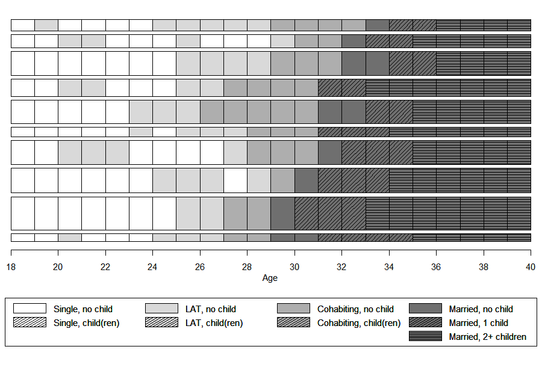
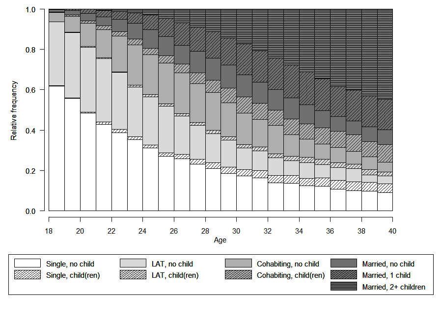
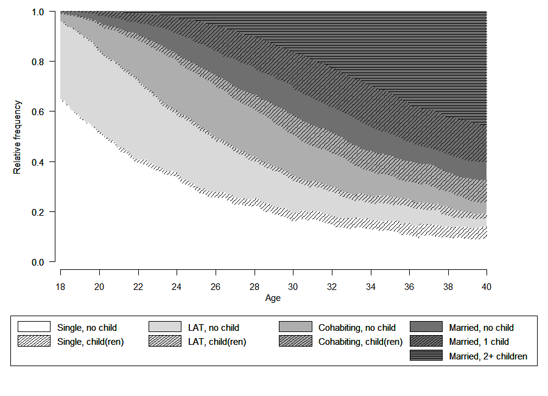

```{r setup, include=FALSE}
knitr::opts_chunk$set(echo = FALSE)

options("kableExtra.html.bsTable" = T)

# load data required for this subchapter
load("2-3-2_VisualizationGrayscale.RData")

# (down)load required packages using pacman
source("0-0_LoadInstallPackages.R")

```

Although the full potential of visualizing sequences can only be reached by using colored figures, some restrictions - particularly hight cost of colored printing - might require to use grayscale figures and shaded lines. This page illustrates how to produce *acceptable* figures without using colors visualizing sequences with an alphabet of 9 states. Based on our experience we consider an alphabet of 12 as the upper limit when the usage of colors is not an option.

```{r echo=FALSE}
kable(tibble(state = longlab.partner.child, shortlabel = shortlab.partner.child), 
      col.names = c("State", "Short Label")) %>%
  kable_styling(bootstrap_options = 
                  c("responsive", "hover", "condensed"),
                full_width = F)
```


## Defining the "color" palette & shading lines

We use R's inbuilt `gray.colors` function to choose grays approriate for our purpose. We apply the following strategy: (1) choose a "color" for each partnership state; (2) add shading lines for fertility information.

We use a palette of nine grays to choose three different grays to represent the partnership states "LAT", "Cohabitation", and "Marriage". The single status will be depicted by White (HEX = "#FFFFFF"). 

```{r eval=FALSE}
barplot(rep(1,9), col = gray.colors(9), axes = FALSE)
```

```{r echo=FALSE, fig.height = 1, fig.width = 6}
par(mar = c(0, 4, 0, 2) + 0.1)
barplot(rep(1,9), col = gray.colors(9), axes = FALSE)
text(1.87, .3, "MAR",cex=.75,pos=3) 
text(5.52, .3, "COH",cex=.75,pos=3)
text(9.12, .3, "LAT",cex=.75,pos=3)
```

We added labels to figure above to illustrate which grays constitute our palette. With the following code we specify and illustrate our final palette.


```{r, eval=FALSE, echo=TRUE}
colgrey.partner.child <- c(rep("#FFFFFF",2),
                           rep(gray.colors(9)[8],2),
                           rep(gray.colors(9)[5],2), 
                           rep(gray.colors(9)[2],3))
                           
barplot(rep(1,9), col = colgrey.partner.child, axes = FALSE)                           
```

```{r, echo=FALSE, fig.height = 1, fig.width = 6}
par(mar = c(0, 4, 0, 2) + 0.1)
colgrey.partner.child <- c(rep("#FFFFFF",2),
                           rep(gray.colors(9)[8],2),
                           rep(gray.colors(9)[5],2), 
                           rep(gray.colors(9)[2],3))
                           
barplot(rep(1,9), col = colgrey.partner.child, axes = FALSE)                           
```

According to the definition of our alphabet we need two single states, two LAT states, two cohabitation states, and three marriage states.
Adding shading lines allows for distinguishing different fertility levels. Shading lines are added by specifying vectors for `density` and `angle`. We use different angles (i.e., 0° and 45°) to separate the two parity states within marriage.

```{r, eval=FALSE, echo=TRUE}
barplot(rep(1,9), col = colgrey.partner.child, axes = FALSE)                           

par(new=TRUE)
barplot(rep(1,9), col = "black", axes = FALSE,
        density=c(0,20,0,20,0,20,0,20,20), 
        angle=c(0,45,0,45,0,45,0,45,0)) 
```


```{r, echo=FALSE, fig.height = 1, fig.width = 6}
par(mar = c(0, 4, 0, 2) + 0.1)
barplot(rep(1,9), col = colgrey.partner.child, axes = FALSE)                           

par(new=TRUE)
barplot(rep(1,9), col = "black", axes = FALSE,
        density=c(0,20,0,20,0,20,0,20,20), 
        angle=c(0,45,0,45,0,45,0,45,0)) 
```

## Adjusting the legend

Based on the section above we draw a legend with the following standard code:


```{r, eval=FALSE, echo=TRUE}
plot(NULL ,xaxt='n',yaxt='n',bty='n',ylab='',xlab='', xlim=0:1, ylim=0:1)

legend("center", legend = longlab.partner.child,
       ncol=3, fill=colgrey.partner.child)
par(new=TRUE)
legend_large_box("center", legend = longlab.partner.child,
                 ncol=3, bg = "transparent",
                 density=c(0,20,0,20,0,20,0,20,20), 
                 angle=c(0,45,0,45,0,45,0,45,0))
```

```{r, echo=FALSE, fig.height = 2, fig.width = 8}
par(mar = c(0, 4, 0, 2) + 0.1)
plot(NULL ,xaxt='n',yaxt='n',bty='n',ylab='',xlab='', xlim=0:1, ylim=0:1)

legend("center", legend = longlab.partner.child,
       ncol=3, fill=colgrey.partner.child)
par(new=TRUE)
legend_large_box("center", legend = longlab.partner.child,
                 ncol=3, bg = "transparent",
                 density=c(0,20,0,20,0,20,0,20,20), 
                 angle=c(0,45,0,45,0,45,0,45,0))

```

Although the legend looks OK at first glance, it has two crucial downsides: (1) The colored boxes (with shading lines) are too small to be distinguished easily; (2) two different partnership states are appearing in the first two columns of the legend. Both issues call for some extra coding because the cannot be solved with the options available standard version of the legend function. 

Addressing the first issue we draw on a tweaked version of the legend suggested by [Ben Bolker](http://ms.mcmaster.ca/~bolker/) and [Paul Hurtado](https://www.pauljhurtado.com/) in a thread at [Stack Overflow](https://stackoverflow.com/questions/13644149/increasing-the-size-of-the-coloured-squares-on-histogram-legends-in-r).

Here you can dowload the tweaked version of the legend function: `r icon::fa("download")` [legend_large_box.R](legend_large_box.R). 

We include the function by sourcing the file within our R-script by typing:

```{r}
source("legend_large_box.R")
```

Next to changing the size of the colored boxes we want to re-arrange the labels of the legend. The new legend should have four columns each representing one partnership state. Each of the first three columns ("Single", "LAT", "Cohabitation") has two entries ("childless", "with child(ren)"). The last column ("Marriage") has three entries ("no child", "one child", "2 or more children").

Typing `ncol=4` when specifying the legend would not do the trick. It would produce a legend with four columns with three entries in the first three columns and zero entries in the last column.

To obtain the desired result we have to add empty cells to the legend and adjust our color vector accordingly. This is accomplished by the following code:

```{r, eval=FALSE, echo=TRUE}
# Adding empty cells at the right positions

# add empty labels below Single, LAT, and Cohabitation
longlab.partner.child2 <- append(longlab.partner.child, "", after=2)  
longlab.partner.child2 <- append(longlab.partner.child2, "", after=5) 
longlab.partner.child2 <- append(longlab.partner.child2, "", after=8) 

# add white colored cells below Single, LAT, and Cohabitation
colgrey.partner.child2 <- append(colgrey.partner.child,"#FFFFFF",after=2)
colgrey.partner.child2 <- append(colgrey.partner.child2,"#FFFFFF",after=5)
colgrey.partner.child2 <- append(colgrey.partner.child2,"#FFFFFF",after=8)

# define border colors for the boxes in legend:
  # regular color = black
  # color for empty cells = white
bordercol.partner.child <- c(rep(c("black","black","White"),3),
                             rep("black", 3))
```

Finally, we can draw the tweaked legend box:

```{r, eval=FALSE, echo=TRUE}
plot(NULL ,xaxt='n',yaxt='n',bty='n',ylab='',xlab='', xlim=0:1, ylim=0:1)
legend_large_box("center", legend = longlab.partner.child2,
                 ncol=4, fill=colgrey.partner.child2, 
                 border = bordercol.partner.child,
                 box.cex=c(4.5,1.5),  y.intersp=2)
par(new=TRUE)
legend_large_box("center", legend = longlab.partner.child2,
                 ncol=4, bg = "transparent", 
                 border = bordercol.partner.child,
                 box.cex=c(4.5,1.5),  y.intersp=2,
                 density=c(0,20,0,0,20,0,0,20,0,0,20,20), 
                 angle=c(0,45,0,0,45,0,0,45,0,0,45,0))
```

```{r, echo=FALSE, fig.height = 2, fig.width = 12}
par(mar = c(0, 4, 0, 2) + 0.1)
plot(NULL ,xaxt='n',yaxt='n',bty='n',ylab='',xlab='', xlim=0:1, ylim=0:1)
legend_large_box("center", legend = longlab.partner.child2,
                 ncol=4, fill=colgrey.partner.child2, 
                 border = bordercol.partner.child,
                 box.cex=c(4.5,1.5),  y.intersp=2)
par(new=TRUE)
legend_large_box("center", legend = longlab.partner.child2,
                 ncol=4, bg = "transparent", 
                 border = bordercol.partner.child,
                 box.cex=c(4.5,1.5),  y.intersp=2,
                 density=c(0,20,0,0,20,0,0,20,0,0,20,20), 
                 angle=c(0,45,0,0,45,0,0,45,0,0,45,0))
```


## Sequence index plot of representative sequences

```{r layout="l-body-outset"}

```


## State distribution plots using yearly & monthly sequence data

```{r layout="l-body-outset"}

```

```{r layout="l-body-outset"}

```