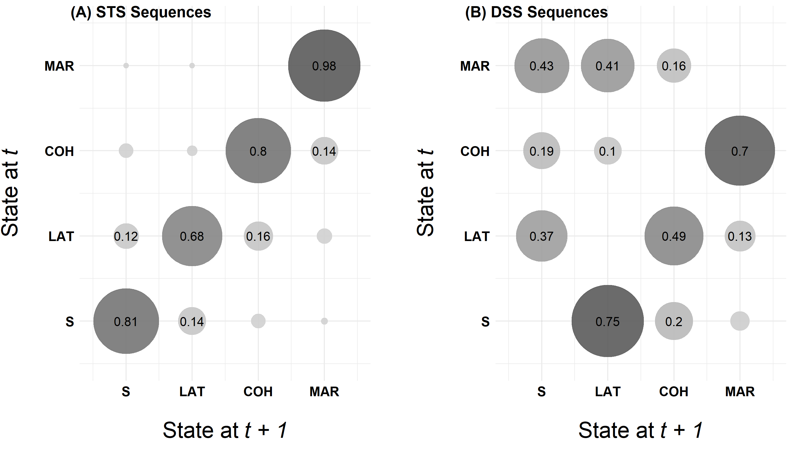
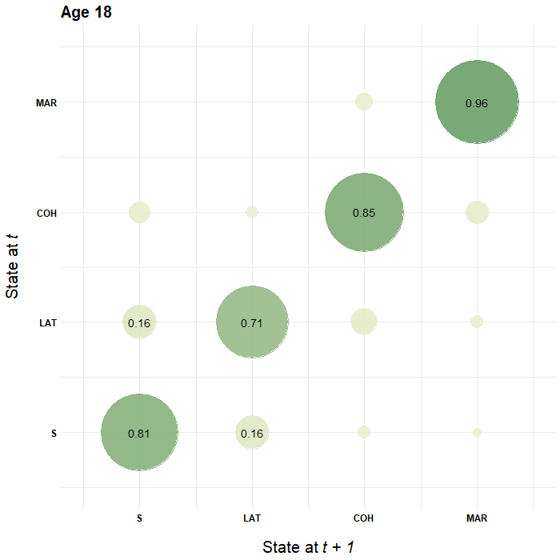
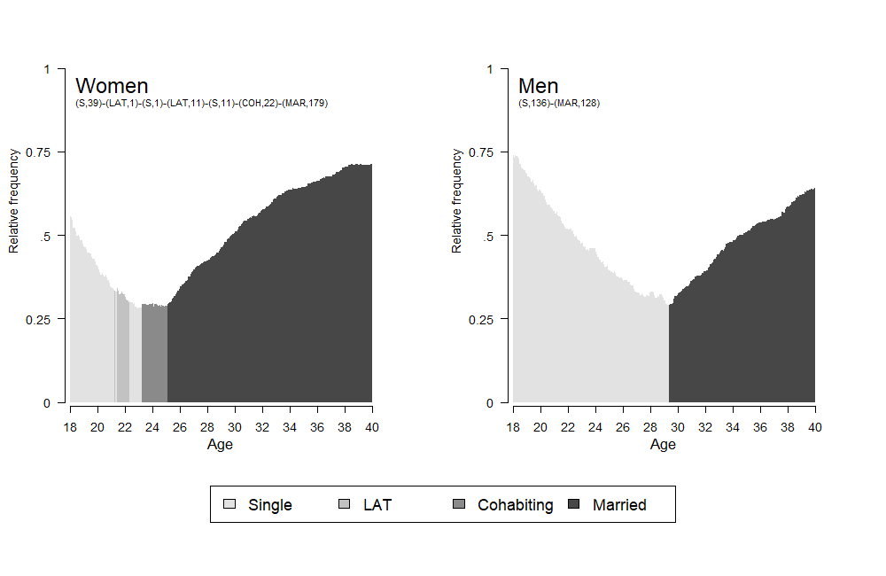
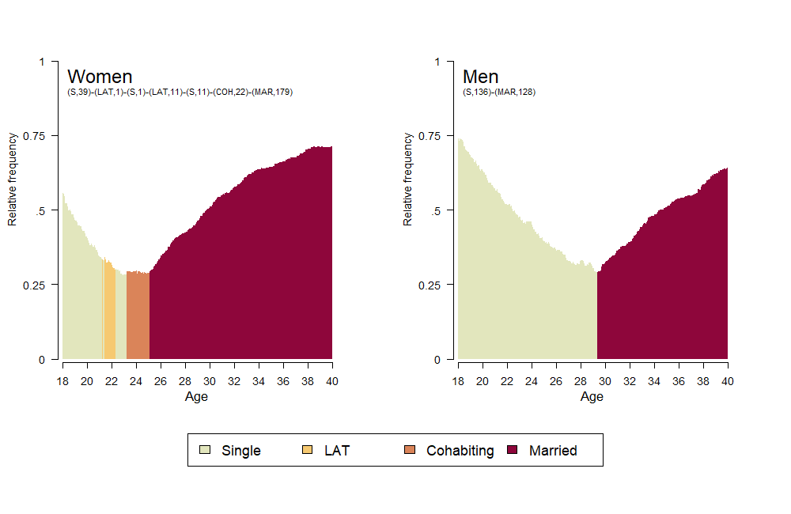
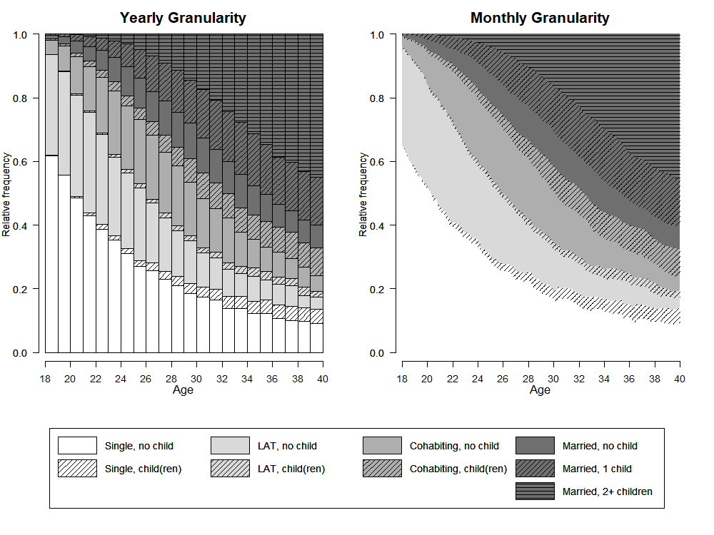
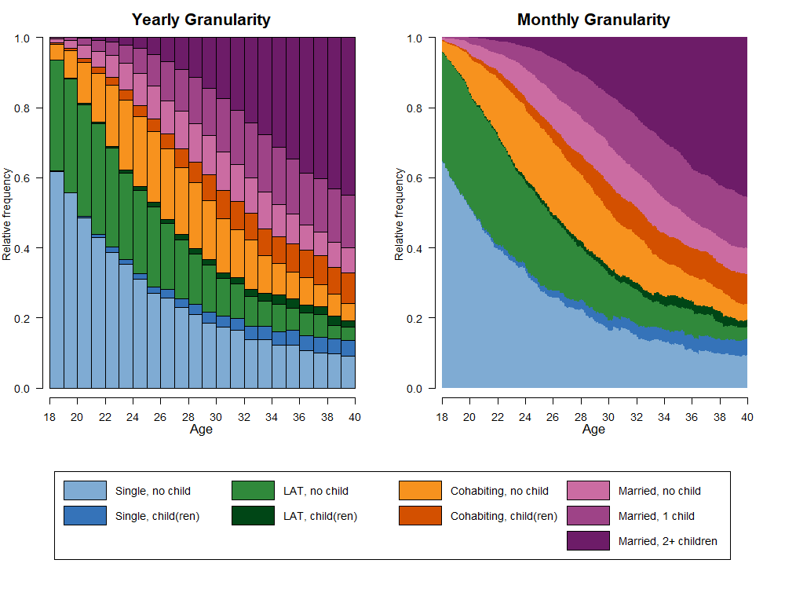
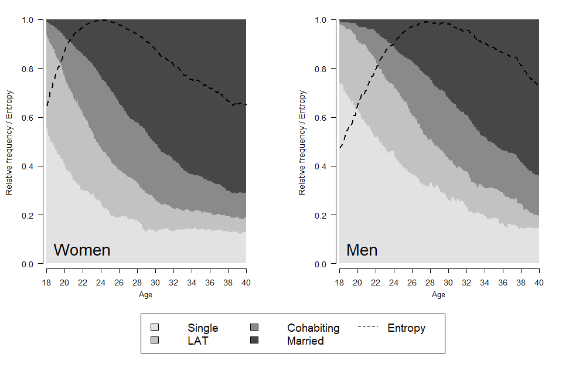
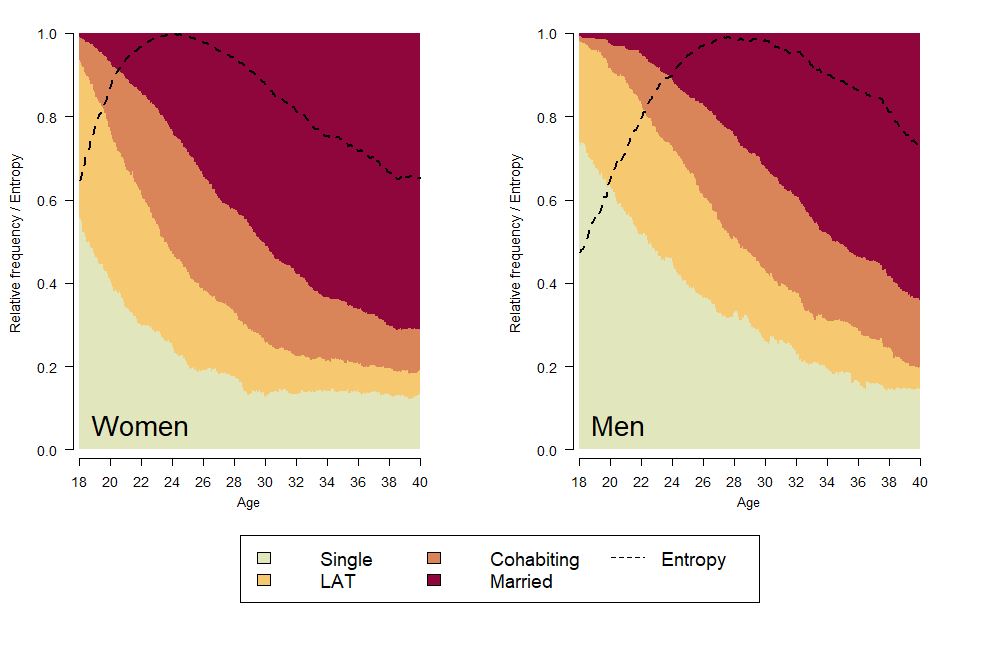

  
  ```{r setup, include=FALSE}
knitr::opts_chunk$set(echo = FALSE)

options("kableExtra.html.bsTable" = T)

# load data required for this subchapter
load("data/2-4_VisualizationGrayscale.RData")

# (down)load required packages using pacman
source("0-0_LoadInstallPackages.R")

```

The figures in the book are printed in grayscale. Here we present both the colored and the grayscale versions of the figures. 

The first plots presented in chapter 2.4.1 are based on a reduced alphabet distinguishing four different partnership states. For the last examples we use a extended state space that combines information on partnership status and fertility. The corresponding tabular presentation can be found [here](rChapter2-3.html). 

## Transition plot

This is the only plot in the book which is not generated by using the `TraMineR` package. It is rendered using `ggplot`. The transition matrix is obtained by `TraMineR`'s `seqtrate` function.  

```{r eval = FALSE, echo = TRUE}

# ------------------------------------------
# Generate plot for sequences in STS format 
# ------------------------------------------

# --------------------------------------------------

# Obtain transition matrix 
transmat <- seqtrate(partner.year.seq)

# --------------------------------------------------

# Prepare data for plotting 
rownames(transmat) <- c(1, 2, 3, 4)
colnames(transmat) <- c(1, 2, 3, 4)

seqtrate_df <- as_tibble(melt(transmat))

# --------------------------------------------------

# Save transition plot as figure using ggplot 
fig.a <- seqtrate_df %>%
  ggplot(aes(x = Var2, y = Var1)) + 
  geom_point(aes(color = value, size = value), alpha = .9) +
  scale_color_continuous_sequential(palette = "Light Grays",
                                    begin = 0.2, end = 0.9) +
  scale_size(range = c(0, 30)) + 
  geom_text(data = filter(seqtrate_df, value>.10), 
            aes(label=round(value, 2)), size = 4) +
  theme_minimal() +
  theme(plot.margin = unit(c(5.5, 20.5, 5.5, 0.5), "pt"),
        legend.position = "none",
        axis.text = element_text(color = "black", 
                                 size = 12, face = "bold"),
        axis.title = element_text(color = "black", 
                                  size = 20, face = "bold"),
        axis.title.y = element_text(margin = margin(0, 20, 0, 0)),
        axis.title.x = element_text(margin = margin(20, 0, 0, 0))) +
  scale_x_continuous(name=expression('State at'~italic("t + 1")), 
                     breaks=c(1,2,3,4), 
                     labels=c("S", "LAT", "COH", "MAR"), 
                     limits=c(0.5, 4.5)) +
  scale_y_continuous(name=expression('State at'~italic("t")),
                     breaks=c(1,2,3,4), 
                     labels=c("S", "LAT", "COH", "MAR"), 
                     limits=c(0.5, 4.5))

# ------------------------------------------------------------------------------
# ------------------------------------------------------------------------------

# --------------------------------------------------------------
# Generate plot for sequences in DSS format (spell perspective)
# --------------------------------------------------------------

# --------------------------------------------------

# Obtain transition matrix
transmat <- seqtrate(seqdss(partner.year.seq))

# --------------------------------------------------

# Prepare data for plotting
rownames(transmat) <- c(1, 2, 3, 4)
colnames(transmat) <- c(1, 2, 3, 4)

seqtrate_df <- as_tibble(melt(transmat))

# --------------------------------------------------

# Save transition plot as figure using ggplot 
fig.b <- seqtrate_df %>%
  ggplot(aes(x = Var2, y = Var1)) + 
  geom_point(aes(color = value, size = value), alpha = .9) +
  scale_color_continuous_sequential(palette = "Light Grays",
                                    begin = 0.2, end = 0.9) +
  scale_size(range = c(0, 30)) + 
  geom_text(data = filter(seqtrate_df, value>.10), 
            aes(label=round(value, 2)), size = 4) +
  theme_minimal() +
  theme(plot.margin = unit(c(5.5, 0.5, 5.5, 20.5), "pt"),
        legend.position = "none",
        axis.text = element_text(color = "black", 
                                 size = 12, face = "bold"),
        axis.title = element_text(color = "black", 
                                  size = 20, face = "bold"),
        axis.title.y = element_text(margin = margin(0, 20, 0, 0)),
        axis.title.x = element_text(margin = margin(20, 0, 0, 0))) +
  scale_x_continuous(name=expression('State at'~italic("t + 1")), 
                     breaks=c(1,2,3,4), 
                     labels=c("S", "LAT", "COH", "MAR"), 
                     limits=c(0.5, 4.5)) +
  scale_y_continuous(name=expression('State at'~italic("t")),
                     breaks=c(1,2,3,4), 
                     labels=c("S", "LAT", "COH", "MAR"), 
                     limits=c(0.5, 4.5))

# ------------------------------------------------------------------------------
# ------------------------------------------------------------------------------

# --------------------
# Generate final plot
# --------------------

ggarrange(fig.a, fig.b, labels = c("(A) STS Sequences", "(B) DSS Sequences"))

```

\  


```{r layout="l-body-outset"}

```

For the colored version `scale_color_continuous_sequential(palette = "Light Grays", begin = 0.2, end = 0.9)` is replaced by `scale_color_continuous_sequential(palette = "Green-Yellow", begin = 0.2, end = 0.8)` 

\  


```{r layout="l-body-outset"}
knitr::include_graphics("images/rChapter2-4_transitions_color.png")
```


The following code generates an animated illustration of time varying transitions rates using the yearly sequence data.
The time varying transition matrices are obtained with the `time.varying = TRUE` option of `seqtrate`. 


```{r eval = FALSE, echo = TRUE}
# ----------------------------------------------------
# Generate an animated version of transition matrices
# ----------------------------------------------------

# --------------------------------------------------

# Obtain time-varying  transition matrix
tratesvar <- seqtrate(partner.year.seq, time.varying = TRUE)
rownames(tratesvar) <- c(1, 2, 3, 4)
colnames(tratesvar) <- c(1, 2, 3, 4)

# --------------------------------------------------

# Transform array with time varying transition rates into tibble
tratesvar <- as_tibble(melt(tratesvar)) %>%
  mutate(Var3 = as.numeric(Var3) + 17,
         value = round(value, 2))

# --------------------------------------------------

# Use ggplot and gganimate to generate animated illustration
p <- tratesvar %>%
  ggplot(aes(x = Var2, y = Var1)) + 
  geom_point(aes(color = value, size = value), alpha = .9) +
  scale_color_continuous_sequential(palette = "Green-Yellow", 
                                    begin = 0.2, end = 0.8) +
  scale_size(range = c(0, 50)) + 
  geom_text(data = filter(tratesvar, value>.10), 
            aes(label=value), size = 5) +
  theme_minimal() +
  theme(legend.position = "none",
        axis.text = element_text(color = "black",
                                 size = 12, face = "bold"),
        axis.title = element_text(color = "black", 
                                  size = 20, face = "bold"),
        axis.title.y = element_text(margin = margin(0, 20, 0, 0)),
        axis.title.x = element_text(margin = margin(20,0, 0, 0)),
        plot.title = element_text(size = 20, face = "bold")) +
  scale_x_continuous(name=expression('State at'~italic("t + 1")), 
                     breaks=c(1,2,3,4), 
                     labels=c("S", "LAT", "COH", "MAR"), 
                     limits=c(0.5, 4.5)) +
  scale_y_continuous(name=expression('State at'~italic("t")), 
                     breaks=c(1,2,3,4), 
                     labels=c("S", "LAT", "COH", "MAR"), 
                     limits=c(0.5, 4.5)) +
  transition_states(Var3) +
  ggtitle('Age {closest_state}')

anim <- animate(p, nframes = 21, duration = 10.5, width = 700, height = 700)

anim_save("seqtrate_yearly.gif", anim)
```

\  

<p align="center">
  {width=70%}
</p>

## Modal state plot

For the modal state plot we use a state space of four partnership states. With the following code we define a sequential "color" palette of four grays. 

```{r eval=FALSE, echo=TRUE}
greys <- sequential_hcl(4, palette = "Light gray", rev = TRUE)
```

Then we define two objects storing the modal sequence for women and men in SPS format.

```{r eval=FALSE, echo=TRUE}
modal_women <- seqdef(as_tibble(seqmodst(partner.month.seq[family$sex==1,])))
modal_women <- print(modal_women, format = "SPS")

modal_men <- seqdef(as_tibble(seqmodst(partner.month.seq[family$sex==0,])))
modal_men <- print(modal_men, format = "SPS")
```

Finally, we can generate a combined graph depicting the modal partnership trajectories for men and women using monthly sequence data.

```{r eval=FALSE, echo=TRUE}
# use layout for generating a combined graph
layout.fig1 <- layout(matrix(c(1,2,3,3), 2, 2, byrow = TRUE),
                      heights = c(.75,.25))
layout.show(layout.fig1)

# draw modal state plot for women
par(mar = c(2, 4, 0, 4) + 0.1, las = 1, 
    mgp=c(2.7,1,-.5))

seqmsplot(partner.month.seq[family$sex==1,], ylab = "Relative frequency",
          with.legend = "FALSE", border = NA, axes = FALSE, cpal = greys)

# draw a box overlapping the standard TraMineR seqmsplot caption
rect(10, 1.05, 254, 1.15, col = "white", border = NA)

# add an alternative caption displaying the gender and the 
# SPS formatted modal sequence
text(5,.95, "Women", cex = 1.75, adj = c(0,.5))
text(5,.9, modal_women, cex = .8, adj = c(0,.5))

# add x-axis
par(mgp=c(3,1,0.25))
axis(1, at=(seq(0,264, by = 24)), labels = seq(18,40, by = 2))
mtext(text = "Age", cex = 1,
      side = 1,#side 1 = bottom
      line = 2.5)

# ... generating the same plot for men
par(mar = c(2, 4, 0, 4) + 0.1, las = 1, 
    mgp=c(2.7,1,-.5))
seqmsplot(partner.month.seq[family$sex==0,], ylab = "Relative frequency",
          with.legend = "FALSE", border = NA, axes = FALSE, cpal = greys)
rect(10, 1.05, 254, 1.15, col = "white", border = NA)
text(5,.95, "Men", cex = 1.75, adj = c(0,.5))
text(5,.9, modal_men, cex = .8, adj = c(0,.5))
par(mgp=c(3,1,0.25))
axis(1, at=(seq(0,264, by = 24)), labels = seq(18,40, by = 2))
mtext(text = "Age", cex = 1,
      side = 1,#side 1 = bottom
      line = 2.5)

# add legend
par(mar=c(0, 1, 0, 1))
seqlegend(partner.month.seq, cex = 1.3, position = "center", 
          ncol = 4, cpal = greys)


dev.off()
```


```{r layout="l-body-outset"}

```

The colored version of the graph is using a palette of heat colors (`colorspace` package). 

```{r eval=FALSE, echo=TRUE}
colspace.partner <- sequential_hcl(4, palette = "Heat", rev = TRUE)
```


```{r layout="l-body-outset"}

```

## State distribution plots

The state distribution plot shown in Figure 2-3 is using sequence data with an alphabet of size nine combining information on partnership status and fertility. 

For the details on generating a grayscale palette and legend please go to [dedicated page on visualizing sequence data in grayscale](rChapter2-4_grayscale.html). 


```{r eval=FALSE, echo=TRUE}
png(file = "DplotYearMonth_grey.png",
    width = 1000, height = 750, res = 100)

# use layout for generating a combined graph
layout.fig <- layout(matrix(c(1,2,3,3), 2, 2, byrow = TRUE),
                      heights = c(.75,.25))
layout.show(layout.fig)

# Draw state distribution plots using yearly data
# Note: The second overlapping plot is required to add shading lines 
par(mar=c(4, 3, 3, 2), las = 1,
    mgp=c(2,1,-.4)) # because y-axis is too far away from plot region
seqdplot(partner.child.year.seq, 
         ylab = "Relative frequency",
         with.legend = "FALSE" , axes = FALSE,
         main = "Yearly Granularity", cex.main = 1.5, 
         cpal = colgrey.partner.child)
par(new=TRUE)
seqdplot(partner.child.year.seq, 
         ylab = "Relative frequency",
         with.legend = "FALSE" , axes = FALSE,
         cpal=rep("#000000",9),
         density=c(0,20,0,20,0,20,0,20,20), 
         angle=c(0,45,0,45,0,45,0,45,0))

# add x-axis
par(mgp=c(3,1,0.5)) # adjust parameters for x-axis
axis(1, at=(seq(0,22, by = 2)), labels = seq(18,40, by = 2))
mtext(text = "Age",
      side = 1, #side 1 = bottom
      line = 2.5)

# draw second dplot using monthly data
par(mar=c(4, 3, 3, 2), las = 1, 
    mgp=c(2,1,-.4))
seqdplot(partner.child.month.seq, 
         ylab = "Relative frequency",
         with.legend = "FALSE" , axes = FALSE, border = NA,
         main = "Monthly Granularity", cex.main = 1.5, 
         cpal = colgrey.partner.child)
par(new=TRUE)
seqdplot(partner.child.month.seq, 
         ylab = "Relative frequency",
         with.legend = "FALSE" , axes = FALSE, , border = NA,
         cpal=rep("#000000",9),
         density=c(0,20,0,20,0,20,0,20,20), 
         angle=c(0,45,0,45,0,45,0,45,0))
par(mgp=c(3,1,0.5))
axis(1, at=(seq(0,264, by = 24)), labels = seq(18,40, by = 2))
mtext(text = "Age",
      side = 1, #side 1 = bottom
      line = 2.5)


## add legend (again the second plot is required for the shading lines)
par(mar=c(0, 1, 0, 1))
plot(NULL ,xaxt='n',yaxt='n',bty='n',ylab='',xlab='', xlim=0:1, ylim=0:1)

legend_large_box("center", legend = longlab.partner.child2,
                 ncol=4, fill=colgrey.partner.child2, 
                 border = bordercol.partner.child,
                 box.cex=c(4.5,1.5),  y.intersp=2,
                 inset=c(0,-.4), xpd=TRUE)
par(new=TRUE)
legend_large_box("center", legend = longlab.partner.child2,
                 ncol=4, bg = "transparent", 
                 border = bordercol.partner.child,
                 box.cex=c(4.5,1.5),  y.intersp=2,
                 inset=c(0,-.4), xpd=TRUE,
                 density=c(0,20,0,0,20,0,0,20,0,0,20,20), 
                 angle=c(0,45,0,0,45,0,0,45,0,0,45,0))

dev.off()

```

```{r layout="l-body-outset"}

```

The code producing the colored figure is shorter because it does not require overlapping plots.

```{r eval=FALSE, echo=TRUE}
# Prelude:
# add white colored cells below Single, LAT, and Cohabitation
colspace.partner.child2 <- append(colspace.partner.child,"#FFFFFF",after=2)
colspace.partner.child2 <- append(colspace.partner.child2,"#FFFFFF",after=5)
colspace.partner.child2 <- append(colspace.partner.child2,"#FFFFFF",after=8)

# The plot
png(file = "rChapter2-4_DplotYearMonth_color.png",
    width = 1000, height = 750, res = 100)

layout.fig1 <- layout(matrix(c(1,2,3,3), 2, 2, byrow = TRUE),
                      heights = c(.75,.25))
layout.show(layout.fig1)


par(mar=c(4, 3, 3, 2), las = 1,
    mgp=c(2,1,-.4)) # because y-axis is too far away from plot region
seqdplot(partner.child.year.seq, 
         ylab = "Relative frequency",
         with.legend = "FALSE" , axes = FALSE,
         main = "Yearly Granularity", cex.main = 1.5, 
         cpal = colspace.partner.child)
par(mgp=c(3,1,0.5)) # adjust parameters for x-axis
axis(1, at=(seq(0,22, by = 2)), labels = seq(18,40, by = 2))
mtext(text = "Age",
      side = 1,#side 1 = bottom
      line = 2.5)

par(mar=c(4, 3, 3, 2), las = 1, 
    mgp=c(2,1,-.4))
seqdplot(partner.child.month.seq, 
         ylab = "Relative frequency",
         with.legend = "FALSE" , axes = FALSE, border = NA,
         main = "Monthly Granularity", cex.main = 1.5, 
         cpal = colspace.partner.child)
par(mgp=c(3,1,0.5))
axis(1, at=(seq(0,264, by = 24)), labels = seq(18,40, by = 2))
mtext(text = "Age",
      side = 1,#side 1 = bottom
      line = 2.5)

par(mar=c(0, 1, 0, 1))
plot(NULL ,xaxt='n',yaxt='n',bty='n',ylab='',xlab='', xlim=0:1, ylim=0:1)

legend_large_box("center", legend = longlab.partner.child2,
                 ncol=4, fill=colspace.partner.child2, 
                 border = bordercol.partner.child,
                 box.cex=c(4.5,1.5),  y.intersp=2,
                 inset=c(0,-.4), xpd=TRUE)
dev.off()
```

```{r layout="l-body-outset"}

```


## State distribution plots with entropy

Figure 2-4 is an enhanced version of a state distribution plot (by gender) which also displays the entropy. The plot requires some adjustment of the legend (adding an entry for "Entropy") and two objects that store the gender-specific entropy distributions. 

```{r eval=FALSE, echo=TRUE}

# adjust legend
col.legend <- c(greys, "white")              # add white filled box
lab.legend <- c(longlab.partner, "Entropy")  # add label for new entry
bcol.legend <- c(rep("black",4), "white")    # define border color for boxes

# Generate objects storing entropy 
entropy.women <- seqstatd(partner.month.seq[family$sex==1,])$Entropy
entropy.men <- seqstatd(partner.month.seq[family$sex==0,])$Entropy

```

After these adjustments the combined graph can be generated with the following code. Using the `layout` command we first arrange the gender-specific plots and the legend (layout matrix: 1 - women; 2 - men; 3 - legend). When drawing the distribution plots lines for the entropy are added with the `lines` function. Finally, an adjusted version of the legend - including a new entry for entropy - is generated.

```{r eval=FALSE, echo=TRUE}

png(file = "rChapter2-4_DplotEntropy_grey.png",
    width = 1000, height = 650, res = 100)

layout.fig1 <- layout(matrix(c(1,2,3,3), 2, 2, byrow = TRUE),
                      heights = c(.75,.25))
layout.show(layout.fig1)

par(mar = c(2, 4, 2, 4) + 0.1, las = 1, 
    mgp=c(2.7,1,-.5))
seqdplot(partner.month.seq[family$sex==1,], ylab = "Relative frequency / Entropy",
         with.legend = "FALSE", border = NA, axes = FALSE,
         cpal = greys)
text(10,.06, "Women", cex = 2, adj = c(0,.5))
lines(entropy.women, col = "black", lwd = 2, lty = 2)

par(mgp=c(3,1,0.25))
axis(1, at=(seq(0,264, by = 24)), labels = seq(18,40, by = 2))
mtext(text = "Age", cex = .8,
      side = 1,#side 1 = bottom
      line = 2.5)

# Draw the same plot for men
par(mar = c(2, 4, 2, 4) + 0.1, las = 1, 
    mgp=c(2.7,1,-.5))

seqdplot(partner.month.seq[family$sex==0,], ylab = "Relative frequency / Entropy",
         with.legend = "FALSE", border = NA, axes = FALSE,
         cpal = greys)
text(10,.06, "Men", cex = 2, adj = c(0,.5))
lines(entropy.men, col = "black", lwd = 2, lty = 2)

par(mgp=c(3,1,0.25))
axis(1, at=(seq(0,264, by = 24)), labels = seq(18,40, by = 2))
mtext(text = "Age", cex = .8,
      side = 1,#side 1 = bottom
      line = 2.5)

# Add adjusted legend
par(mar=c(0, 1, 0, 1))
plot(NULL ,xaxt='n',yaxt='n',bty='n',ylab='',xlab='', xlim=0:1, ylim=0:1)
legend("center", legend = lab.legend, ncol=3, fill=col.legend, 
       lty=c(rep(0,4),2), border = bcol.legend, cex = 1.4)
       
dev.off()
```


```{r layout="l-body-outset"}

```

For the colored version of the same figure `grey` has to replaced by the name of the colored palette (here: `colspace.partner`).


```{r layout="l-body-outset"}

```
