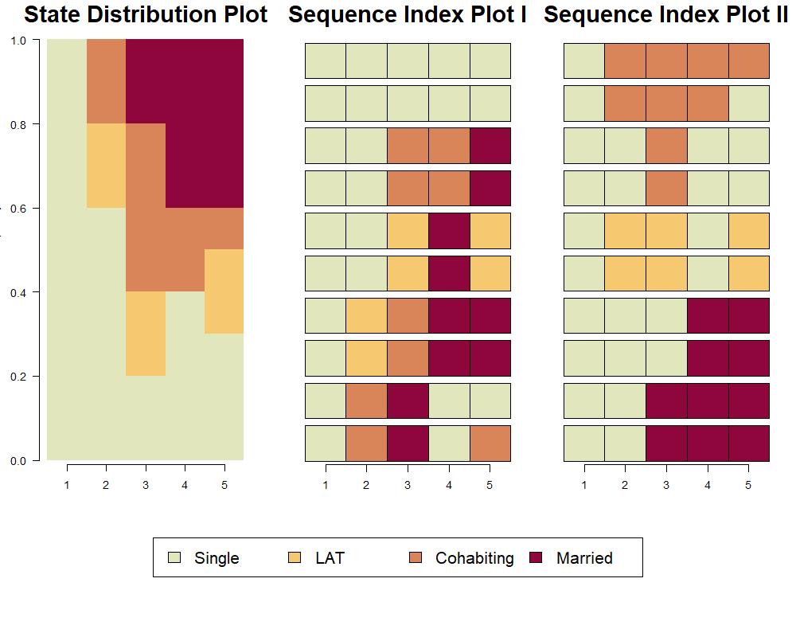
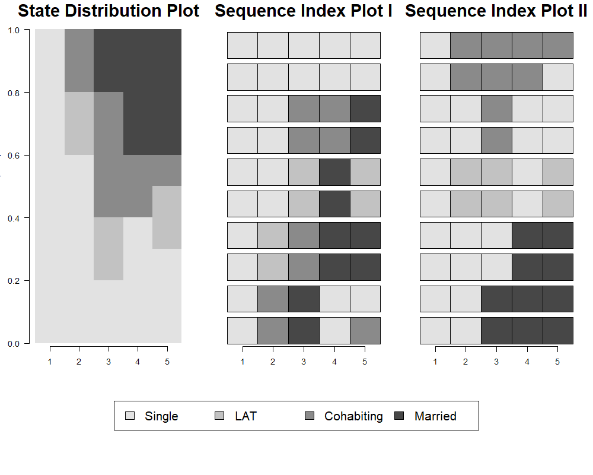
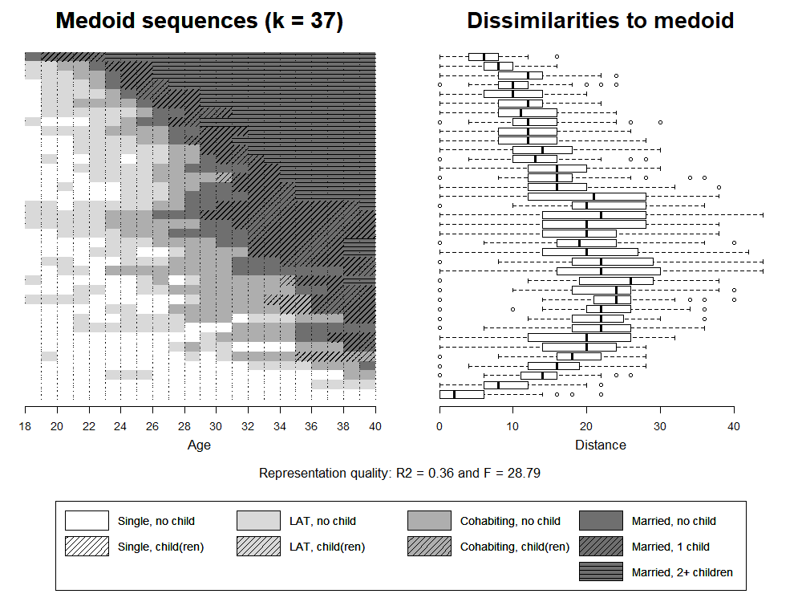
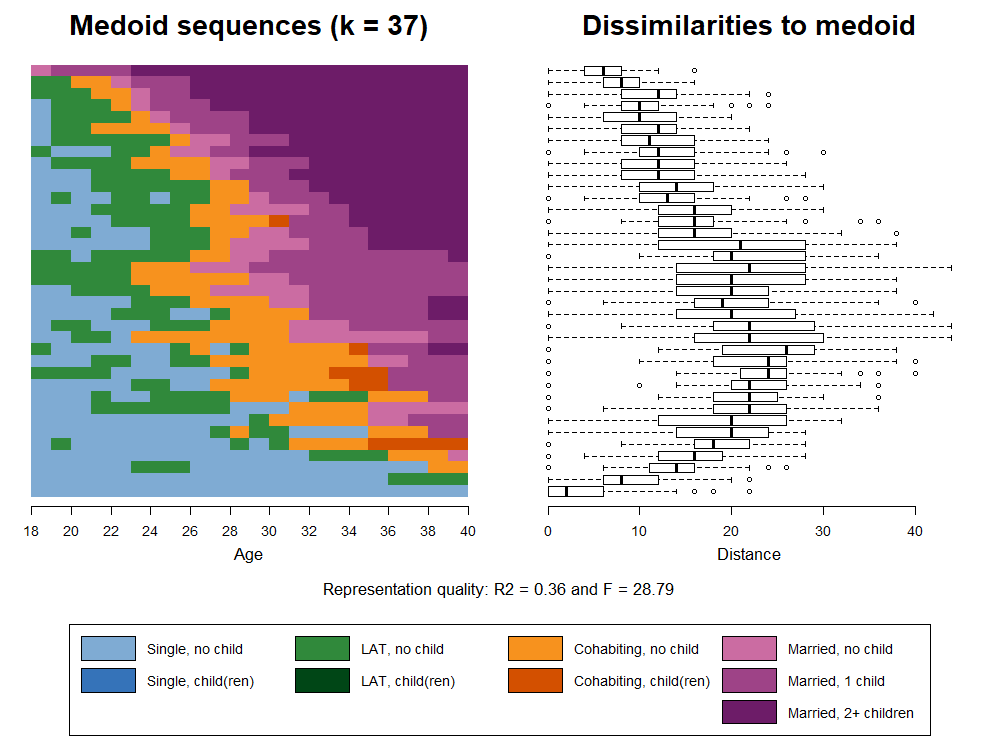
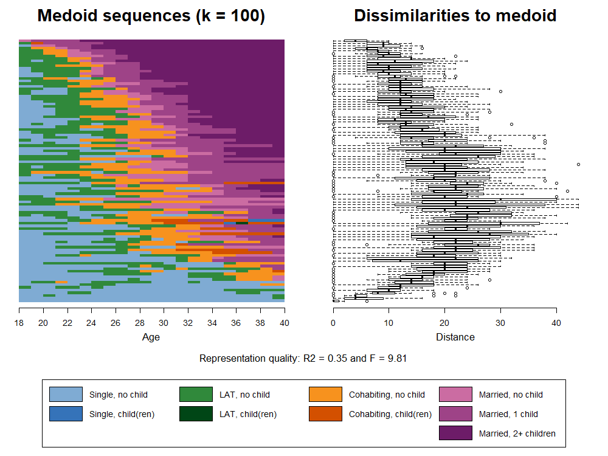
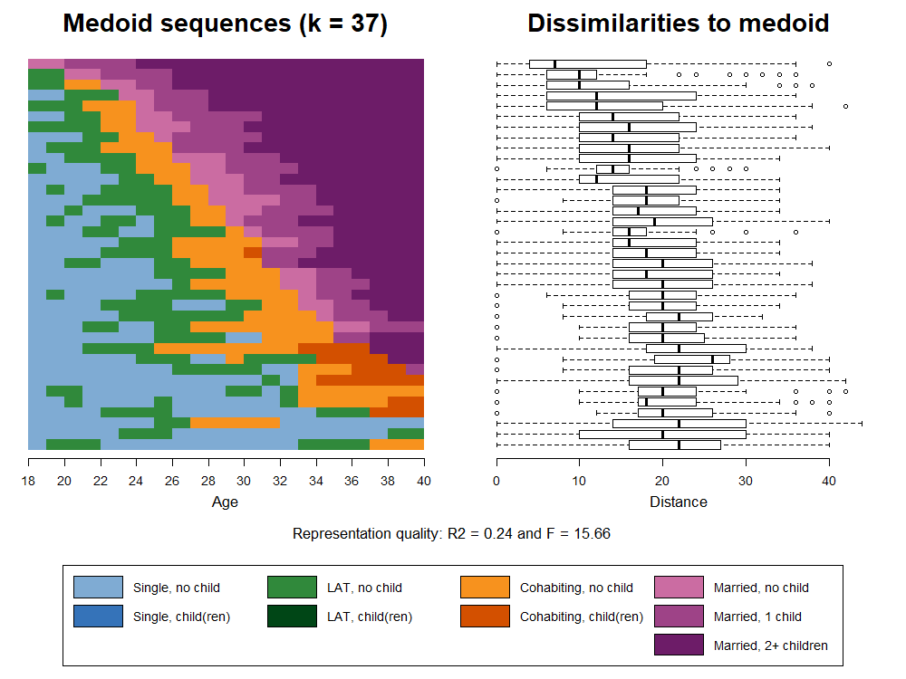
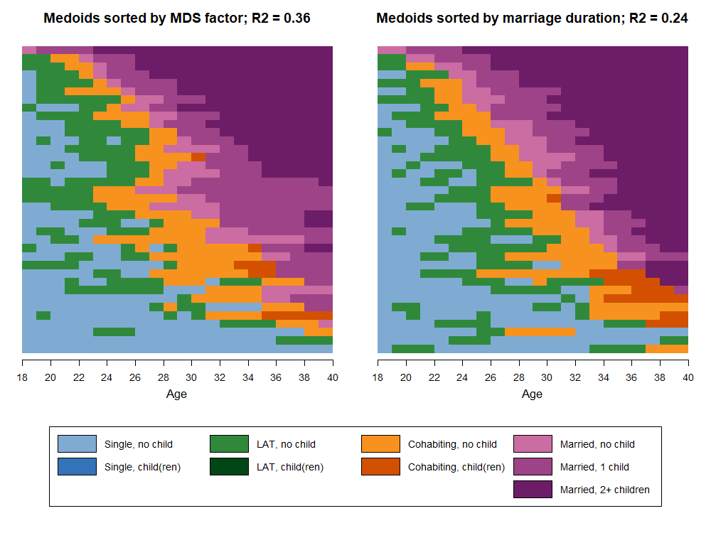

  
```{r setup, include=FALSE}
knitr::opts_chunk$set(echo = FALSE)

options("kableExtra.html.bsTable" = T)

# load data required for this subchapter
load("data/2-4_VisualizationGrayscale.RData")

# (down)load required packages using pacman
source("0-0_LoadInstallPackages.R")

```

The figures in the book are printed in grayscale. Here we present both the colored and the grayscale versions of the figures. 


The first plots presented in chapter 2.4.1 are based on a reduced alphabet distinguishing four different partnership states. For the last examples we use a extended state space that combines information on partnership status and fertility. The corresponding tabular presentation can be found [here](rChapter2-3.html). 

## Different sets of sequences, <br/>same state distribution 

Using two small example dataset each containing ten constructed partnership biographies, Figure 2-5 illustrates that the aggregation of different sets of sequences can yield identical aggregated state distributions.

The two example datasets are defined as:

```{r eval = TRUE, echo = TRUE}

# ===============================================
# Generating two example datasets; k = 5; n = 10
# ===============================================

ex1 <- tibble(state1 = c(1, 1, 1, 1, 1, 1, 1, 1, 1, 1),
              state2 = c(1, 1, 1, 1, 2, 2, 1, 1, 3, 3),
              state3 = c(1, 1, 3, 3, 3, 3, 2, 2, 4, 4),
              state4 = c(1, 1, 3, 3, 4, 4, 4, 4, 1, 1),
              state5 = c(1, 1, 4, 4, 4, 4, 2, 2, 3, 1))


ex2 <- tibble(state1 = c(1, 1, 1, 1, 1, 1, 1, 1, 1, 1),
              state2 = c(1, 1, 1, 1, 2, 2, 1, 1, 3, 3),
              state3 = c(1, 1, 4, 4, 2, 2, 3, 3, 3, 3),
              state4 = c(4, 4, 4, 4, 1, 1, 1, 1, 3, 3),
              state5 = c(4, 4, 4, 4, 2, 2, 1, 1, 1, 3))

```

In a next step the datasets are defined as sequence objects:

```{r eval = TRUE, echo = TRUE}

# Define long and short labels
shortlab.partner <- c("S", "LAT", "COH", "MAR")
longlab.partner <-  c("Single", "LAT", "Cohabiting", "Married")

# Definition of color palettes using the colorspace package
  # colors
  colspace.partner <- sequential_hcl(4, palette = "Heat", rev = TRUE)

  # grays
  grays <- sequential_hcl(4, palette = "Light gray", rev = TRUE)
  

# Define sequence objects

partner.ex1.seq  <- seqdef(ex1, states = shortlab.partner,
                           labels = longlab.partner, alphabet = c(1:4),
                           cpal = colspace.partner) 

partner.ex2.seq  <- seqdef(ex2, states = shortlab.partner,
                           labels = longlab.partner, alphabet = c(1:4),
                           cpal = colspace.partner)
  
  
```  

```{r include = FALSE}
ex1.seq.sps <- print(partner.ex1.seq, format = "SPS")
ex2.seq.sps <- print(partner.ex2.seq, format = "SPS")
```  

This gives us the following two sets of sequences, which are plotted as state distribution and index plots in the next step. Both sets can be described by the same distribution plot, although they produce different index plots.

\  

```{r eval = TRUE, echo = FALSE}
tibble(`Example sequences - set 1` = ex1.seq.sps,
       `Example sequences - set 2` = ex2.seq.sps) %>%
  kable() %>%
  kable_styling(bootstrap_options =
                  c("responsive", "hover", "condensed"),
                full_width = F)
```

\  

Note that the color palette specified in `seqdef` will be used as the default when the respective sequence object is plotted with one of the `seqplot` functions. This behavior can be changed by adding the `cpal` argument to `seqplot.` Thus, the gray version of the figure shown below is produced by adding `cpal = grays` or re-defining the sequence objects whith the respective palette. 


```{r eval = FALSE, echo = TRUE}

png(file = "figures/rChapter2-4-2_Fig2-5_dplot_iplots_color.png",
    width = 1000, height = 800, res = 130)

layout.fig1 <- layout(matrix(c(1,2,3,4,4,4), 2, 3, byrow = TRUE),
                      heights = c(.75,.25), widths = c(.35, .325, .325))
layout.show(layout.fig1)


par(mar = c(1, 3, 3, 2), las = 1)
seqdplot(partner.ex1.seq, ylab = "Relative frequency", 
         with.legend = "FALSE", border = NA,  axes = FALSE) 
title(main = "State Distribution Plot", cex.main = 2, line = 1.35)
axis(1, at=c(.5:4.5), labels = c(1:5))

par(mar = c(0, 2, 2, 2), mgp = c(3, 1, -.97))
seqiplot(partner.ex1.seq, sortv = seqfpos(partner.ex1.seq,"MAR"),
         with.legend = "FALSE", yaxis = FALSE, axes = FALSE,
         main = "Sequence Index Plot I", cex.main = 2)
axis(1, at=c(.5:4.5), labels = c(1:5))
seqiplot(partner.ex2.seq, sortv = seqfpos(partner.ex2.seq,"MAR"),
         with.legend = "FALSE", yaxis = FALSE, axes = FALSE,
         main = "Sequence Index Plot II", cex.main = 2)
axis(1, at=c(.5:4.5), labels = c(1:5))

par(mar = c(0, 2, 0, 2))
seqlegend(partner.ex1.seq, cex = 1.5, position = "center", ncol = 4)


dev.off()

```

\  

```{r layout="l-body-outset"}


```

## The relative frequency index plot

This section illustrates how to render relative frequency index plot using the standard `seqIplot` function instead of `TraMineRextras' seqplot.rf`. Although `seqIplot` produces an appealing result, the function lacks flexibility. First, it does not allow for supressing the box-and-whiskerplot which is depicting the dissimilarities to the medoids. Second, it is not suited for producing grayscale figures that use shading lines to differentiate between states.

Accordingly, we generated a tweaked version of `seqplot.rf` which does not render the graph but stores the information required to generate the desired visualization "manually". This information is saved in a list object and the different elements of this list will be used to render the plot.

Here you can download the tweaked version of `seqplot.rf`: `r icon::fa("download")` [relfreqseq-obj.R]("source/relfreqseq-obj.R").

Generating a relative frequency index plot requires sorting of the sequences to be sorted 

according to a substantively meaningful principle. By default `seqplot.rf` (and `relfreqseq-obj.R`) sorts the sequences according to their score on the first factor derived by applying multidimensional scaling on a matrix of pairwise dissimilarities between sequences. This distance matrix has to be calculated prior to the call of the `seqplot.rf` function. The following command is generating such a matrix using Optimal Matching with the default cost specification (indel = 1, substitution = 2) on our family fomration sequence data (yearly granularity). For further details on dissimilarity measures see material on [Chapter3](rChapter3.html).

```{r eval = FALSE, echo = TRUE}
partner.child.year.om <- seqdist(partner.child.year.seq, method="OM", sm= "CONSTANT")
```

Once the dissimilarity matrix is generated, the information required for the plots can be extracted and save as a list object by the new `relfreqseq-obj` function. 

```{r eval = FALSE, echo = TRUE}
source("relfreqseq-obj.R")
k37.mds <- relfreqseq.obj(partner.child.year.seq,
                          diss=partner.child.year.om, 
                          k=37)
```

Based on this object we finally can produce Figure 2-6. Note that we do not use `legend_large_box` instead of the the regular legend function to obtain a more appealing result. We also rearrange the states shown in the legend by adding empty entries to the initial label object. See companion page [Color palette: Grayscale Edition](rChapter2-4_grayscale.html#legend-link) for further details on the tweaked legend. 

Below we show the code for the grayscale version (`cpal = colgrey.partner.child`) of the figure which requires overlapping index plots and legends (`par(new=TRUE)`) to combine a grayscale palette with shaded lines. For the identical colored figure these two elements of the figure have to be rendered only once.


```{r eval = FALSE, echo = TRUE}
png(file = "Fig2-6_relfreqIplot_mds_gray.png",
    width = 1000, height = 750, res = 100)

layout.fig <- layout(matrix(c(1,2,3,3), 2, 2, byrow = TRUE),
                      heights = c(.75,.25))
layout.show(layout.fig)

par(mar=c(3, 2, 3, 2))
seqIplot(k37.mds[[1]], 
         with.legend=FALSE,
         axes = FALSE,
         yaxis = FALSE, ylab = NA,
         main="Medoid sequences (k = 37)", cex.main = 2,  
         sortv=k37.mds[[2]],
         cpal = colgrey.partner.child)
par(new=TRUE)
seqIplot(k37.mds[[1]], 
         with.legend=FALSE,
         axes = FALSE,
         yaxis = FALSE, ylab = NA,
         main="Medoid sequences (k = 37)", cex.main = 2,  
         sortv=k37.mds[[2]],
         cpal=rep("#000000",9),
         density=c(0,20,0,20,0,20,0,20,20), 
         angle=c(0,45,0,45,0,45,0,45,0))
par(mgp=c(3,1,-0.5)) # adjust parameters for x-axis
axis(1, at=(seq(0,22, by = 2)), labels = seq(18,40, by = 2))
mtext(text = "Age",
      side = 1,#side 1 = bottom
      line = 2)

par(mar=c(3, 2, 3, 2),
    mgp=c(3,1,-0.5)) # adjust parameters for x-axis
boxplot(k37.mds[[3]]~k37.mds[[2]], 
        horizontal=TRUE, 
        width=k37.mds[[4]], 
        frame=FALSE, 
        main="Dissimilarities to medoid", cex.main = 2, 
        at=k37.mds[[6]],
        yaxt='n', ylab = NA, xlab = NA)
mtext(text = "Distance",
      side = 1,#side 1 = bottom
      line = 2)

par(mar=c(1, 1, 4, 1))
plot(NULL ,xaxt='n',yaxt='n',bty='n',ylab='',xlab='', xlim=0:1, ylim=0:1)

legend_large_box("center", legend = longlab.partner.child2,
                 ncol=4, fill=colgrey.partner.child2, 
                 border = bordercol.partner.child,
                 box.cex=c(4.5,1.5),  y.intersp=2,
                 inset=c(0,-.4), xpd=TRUE)
par(new=TRUE)
legend_large_box("center", legend = longlab.partner.child2,
                 ncol=4, bg = "transparent", 
                 border = bordercol.partner.child,
                 box.cex=c(4.5,1.5),  y.intersp=2,
                 inset=c(0,-.4), xpd=TRUE,
                 density=c(0,20,0,0,20,0,0,20,0,0,20,20), 
                 angle=c(0,45,0,0,45,0,0,45,0,0,45,0))

title(main = paste("Representation quality: R2 =", 
                   round(as.numeric(k37.mds["R2"]),2),
                   "and F =", round(as.numeric(k37.mds["Fstat"]),2)), 
      line = 2, font.main = 1)

dev.off()
```

\  

```{r layout="l-body-outset"}


```

## Bonus material: <br/>Additional relative frequency sequence plots

The quality and the appearance of relative frequency sequence plots heavily depend on the underlying analytical choices. Below we illustrate how the plot looks like with more frequency groups (k=100) and a different sorting criterion (time spent in marriage). The marital states are the last three states of the alphabet (`alphabet(partner.child.year.seq)[7:9]`), the respective state frequencies are extracted by TraMineR's `seqistatd` function, and summed up using `rowSums`. The plots are generated in excactly the same way as above. We only have to replace `k37.mds` with `k100.mds` and `k37.mardur` respectively.

```{r eval = FALSE, echo = TRUE}

k100.mds <- relfreqseq.obj(partner.child.year.seq,
                          diss=partner.child.year.om, 
                          k=100)

k37.mardur <- relfreqseq.obj(partner.child.year.seq,
                             diss=partner.child.year.om,
                             sortv = rowSums(seqistatd(partner.child.year.seq)[,7:9]),
                             k=37)
```

```{r layout="l-body-outset"}


```

Compared to the plot shown in the book (`k37.mds`) the addition of 63 additional frquency groups (`k100.mds`) leads to a slightly more nuanced index plot. The medoids, however, are not performing better in representing the sequences within their frequency groups (see R2).

Regarding `k37.mardur` the dissimilarities to medoid plot and the lower R2 show that this sorting criterion performs worse than the MDS-bases plot with the same number of frequency groups (`k37.mds`). In the next figure we re-plot only the two medoid sequences of the two solutions to ease the comparison. In terms of code this means, that the box-whisker-plot from the previous code snippet (`boxplot(k37.mds[[3]]~k37.mds[[2]] ...`) has to replaced by another `seqIplot`. In addition, we slightly adjust the two index plots' titles to print the repsective R2s.

```{r eval = FALSE, echo = TRUE}
png(file = "Fig2-6-bonus_relfreqIplot_mds_vs_mardur_color.png",
    width = 1000, height = 750, res = 100)

layout.fig1 <- layout(matrix(c(1,2,3,3), 2, 2, byrow = TRUE),
                      heights = c(.75,.25))
layout.show(layout.fig1)


par(mar=c(3, 2, 3, 2))
seqIplot(k37.mds[[1]], 
         with.legend=FALSE,
         axes = FALSE,
         yaxis = FALSE, ylab = NA,
         main= paste("Medoids sorted by MDS factor; R2 =", 
                     round(as.numeric(k37.mds["R2"]),2)),
         cex.main = 1.4,  
         sortv=k37.mds[[2]])

par(mgp=c(3,1,-0.5)) # adjust parameters for x-axis
axis(1, at=(seq(0,22, by = 2)), labels = seq(18,40, by = 2))
mtext(text = "Age",
      side = 1,#side 1 = bottom
      line = 2)

par(mar=c(3, 2, 3, 2))
seqIplot(k37.mardur[[1]], 
         with.legend=FALSE,
         axes = FALSE,
         yaxis = FALSE, ylab = NA,
         main= paste("Medoids sorted by marriage duration; R2 =", 
                     round(as.numeric(k37.mardur["R2"]),2)),
         cex.main = 1.4,
         sortv=k37.mardur[[2]])

par(mgp=c(3,1,-0.5)) # adjust parameters for x-axis
axis(1, at=(seq(0,22, by = 2)), labels = seq(18,40, by = 2))
mtext(text = "Age",
      side = 1,#side 1 = bottom
      line = 2)

par(mar=c(1, 1, 1, 1))
plot(NULL ,xaxt='n',yaxt='n',bty='n',ylab='',xlab='', xlim=0:1, ylim=0:1)

legend_large_box("center", legend = longlab.partner.child2,
                 ncol=4, fill=colspace.partner.child2, 
                 border = bordercol.partner.child,
                 box.cex=c(4.5,1.5),  y.intersp=2,
                 inset=c(0,-.4), xpd=TRUE)

dev.off()
```

```{r layout="l-body-outset"}

```

While there is a notable share of resemblance between the two plots, they also show some marked differences. The medoids in the right panel are much more dominated by the state "Married 2+ children". Note that both graphs still represent the same data. The sorting criterion just led to a different selection of medoids and consequently to different visual representations of the same data. 

Ultimately, relative frequency sequence plots are a data reduction strategy whose results depend on the input parameters. Luckily, the R2 values and F test allow to evaluate and to compare the quality of different solutions. It is also worthwile to inspect how the state distributions at different positions of the sequence compare to those shown in the state distribution plot (which presents in summary of the entire data set as opposed to a selection of representative sequences). Based on these criteria we prefer the sorting based on multidimensional scaling for generating relative frequency sequence plots with our example data.

In general, we recommend to test different specifications in terms of the sorting criterion, the dissimilarity measure, and the number of chosen frequency groups. In our example, for instance, we used a rather low number of frequency groups in order to ensure readibilty of the grayscale figures. The results, however, were robust to changes in the number of frequency groups. 
