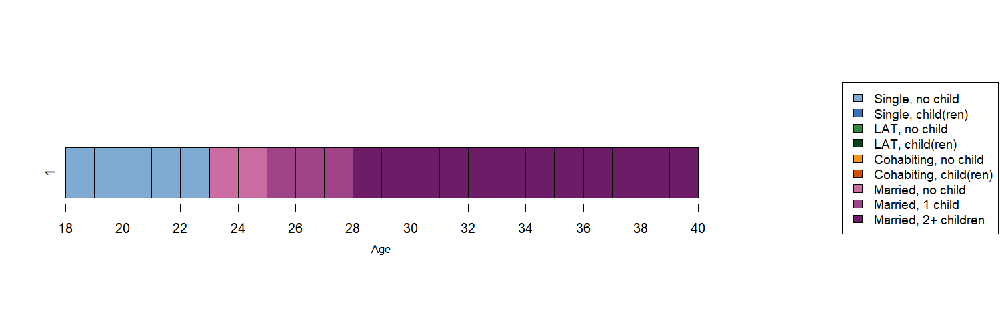
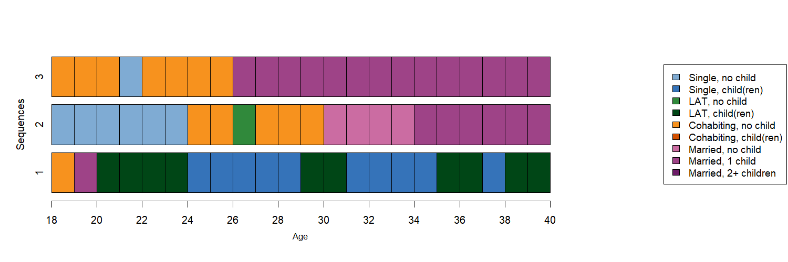
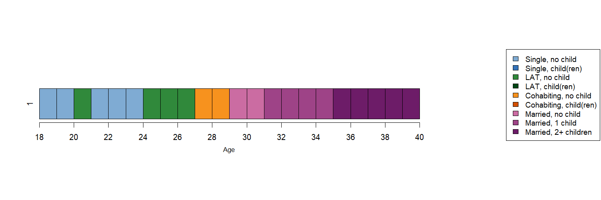
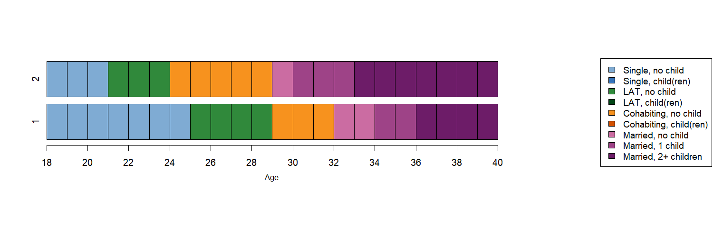

```{r setup, include=FALSE}
knitr::opts_chunk$set(echo = FALSE)

options("kableExtra.html.bsTable" = T)


# load data required for this subchapter
load("C:/Users/struffolino/Documents/GitHub/companion/data/3-0_ChapterSetup.RData")

# (down)load required packages using pacman
source("0-0_LoadInstallPackages.R")

```

# Dissimilarity from a theoretical (ideal-typical) sequence

Depending on theoretical expectations of what a specific process should look like, we might want to consider different possible empirical realizations. To this purpose, we can imputing a reference sequence that reflects theoretical expectations about the appearance of specific states and their timing.

```{r, eval=TRUE, echo=TRUE}
theo.sps<-as.matrix("(S,5)-(MAR,2)-(MARc1,3)-(MARc2+,12)")
```

The object, however, is in SPS format:

```{r, eval=TRUE, echo=FALSE}
theo.sps
```

We need to transfor it in STS format:

```{r, eval=TRUE, echo=TRUE}
theo.sts <- seqformat(theo.sps, from = "SPS", to = "STS")
```

and therefore obtain:

```{r, eval=TRUE, echo=FALSE}
theo.sts
```

This string is not a sequence object yet, so that we define it as a sequence with the usual procedure:

```{r, eval=TRUE, echo=TRUE}
theo.seq<-seqdef(theo.sts, 
                 states = shortlab.partner.child,
                 alphabet = shortlab.partner.child,
                 xtstep = 1)
```

<p align="center">
{width=110%}
</p>

Finally, we can compute the dissimilarity matrix that this time includes the dissimilarity between the reference sequence `theo.seq` and all sequences in the dataset. The option `refseq` can be specified by indicating the name of the sequence used as a reference (as in the following example): the `TraMineR` documentation of the `seqdist` functin presents alternative specifications that might be useful depending on the research question.

```{r, eval=TRUE, echo=TRUE}
dist.theo<-seqdist(partner.child.year.seq.now, method = "OM", indel = 1, sm = "CONSTANT", refseq = theo.seq)
```

Let us consider for illustrative purposes the dissimilarity between the theoretical sequence and the (usual) three example sequences:

<p align="center">
{width=110%}
</p>

The dissimilarity between these three sequences and the theoretical sequence is, respectively:

```{r, eval=TRUE, echo=FALSE}
n<-c(1,2,3)
table.diss1<-data.frame(n,
                        dist.theo[1:3])
  
kable(table.diss1, escape = F, format = "html", 
        col.names = c("Sequence", "Dissimilarity<br>to reference seq.")) %>%
    kable_styling(bootstrap_options = 
                    c("responsive", "hover", "condensed"),
                  full_width = F)
```


Sequence 2 is most similar to the ideal-typical one, displaying similar sequencing of the same states but with different timing. In contrast, sequence 3 is the most different because the individual “visited” a smaller number of states compared to the reference sequence. Sequence 1 is highly dissimilar to the reference sequence, but this is the case because this individual has more states visited in common with the ideal-typical one compared to sequence 3.


# Dissimilarity from the most frequent sequence

If we want to compare all sequences in the sample to the empirically most frequent one, we can identify it using the `seqtab` function, where the argument `idxs` allows for specifying the number of most frequent sequences to be estracted. Here, we consider only the first most frequent, and therefore we speficy it as follows: 

```{r, eval=TRUE, echo=TRUE}
mostfreq.seq<-seqtab(partner.child.year.seq.now, 
                     idxs = 1,
                     weighted = FALSE, 
                     format = "SPS")
```

and obtain: 

```{r, eval=TRUE, echo=FALSE}

t1<-data.frame(c("S/22"),
               c("14"),
               c("0.75"))

kable(t1, escape = F, format = "html", 
            col.names = c("Sequence","Frequency", "Percentage")) %>%
        kable_styling(bootstrap_options = 
                        c("responsive", "hover", "condensed"),
                      full_width = F)
                  
```

that visually translate as follows:

<p align="center">
{width=110%}
</p>

The percentage on the y-axis refers to the share of sequences identical to the one plotted.
We can then compute the dissimilarity matrix specifying the `refseq` using `mostfreq.seq` as reference sequence

```{r, eval=TRUE, echo=FALSE}
dist.mostfreq<-seqdist(partner.child.year.seq.now, 
                      method = "OM", indel = 1, sm = "CONSTANT", 
                      refseq = mostfreq.seq)
```

The dissimilarity between the three real sequences considered above and the most frequent sequence is, respectively:

```{r, eval=TRUE, echo=FALSE}

n<-c(1,2,3)
table.diss2<-data.frame(n,
                        dist.mostfreq[1:3])
  
kable(table.diss2, escape = F, format = "html", 
        col.names = c("Sequence", "Dissimilarity<br>to reference seq.")) %>%
    kable_styling(bootstrap_options = 
                    c("responsive", "hover", "condensed"),
                  full_width = F)

```


# Dissimilarity from the medoid

If we want to compare all sequences in the sample to the medoid, we first have to compute a standard pairwise dissimilarity matrix. For illustrative purposes, we set `indel = 1` and substitution costs `sm = CONSTANT` to generate the paiwise dissimilarity matrix `om.s2.i1`: 

```{r, eval=TRUE, echo=TRUE}
om.s2.i1<-seqdist(partner.child.year.seq.now, method = "OM", indel = 1, sm = "CONSTANT")
```

We then  identify the medois using the the `disscenter` function, where the argument `medoids.index` allows for specifying the option `first` to obtain the index of the first encountered most central sequence:

```{r, eval=TRUE, echo=TRUE}
medoid.seq <- disscenter(om.s2.i1, medoids.index = "first")
```

The medoid sequence is, in this case:

```{r, eval=TRUE, echo=TRUE}
print(partner.child.year.seq.now[medoid.seq, ], format = "SPS")
```

that visually corresponds to:

<p align="center">
{width=110%}
</p>

This plot can be obtained by specifying `partner.child.year.seq.now[medoid.seq,]` in the `seqiplot` function:

```{r, eval=FALSE, echo=TRUE}

png(file = "rChapter3-7-6_medoid_colors.png", 
    width = 1500, height = 500, res = 120)

layout.fig1 <- layout(matrix(seq(1:2), 1, 2, byrow = TRUE),
                      widths = c(.7, .3))
layout.show(layout.fig1)

par(mar = c(8.2, 4, 9, 0) + 0.1, las = 1, 
    mgp=c(2,1,-.5))
seqiplot(partner.child.year.seq.now[medoid.seq,], ylab = "",
         with.legend = "FALSE", border = TRUE, axes = FALSE,
         cpal = colspace2, main = "")
par(mgp=c(3,1,0.25))
axis(1, at=(seq(0,22, 2)), labels = seq(18,40, by = 2))
mtext(text = "Age", cex = .8,
      side = 1,#side 1 = bottom
      line = 2.5)

par(mar = c(5, 0, 4, 0) + 0.1)
seqlegend(partner.child.year.seq.now, 
          cpal = colspace2, cex = .95, position = "right")

dev.off()
```

We can now compute the  dissimilarity matrix specifying the `refseq` using `medoid.seq[1]` as reference sequence

```{r, eval=TRUE, echo=TRUE}
dist.medoid<-seqdist(partner.child.year.seq.now, method = "OM", indel = 1, sm = "CONSTANT", 
                     refseq = medoid.seq[1])
```

The dissimilarity between the three real sequences considered above and the medoid is, respectively:

```{r, eval=TRUE, echo=FALSE}
n<-c(1,2,3)
table.diss3<-data.frame(n,
                        dist.medoid[1:3])
  
kable(table.diss3, escape = F, format = "html", 
        col.names = c("Sequence", "Dissimilarity<br>to reference seq.")) %>%
    kable_styling(bootstrap_options = 
                    c("responsive", "hover", "condensed"),
                  full_width = F)
```

If one wants to extract different medoids for different groups (for example by gender), it is possible to specify the `group` option accordingly:

```{r, eval=TRUE, echo=TRUE}
medoid.sex.seq <- disscenter(om.s2.i1, group=family$sex, medoids.index = "first")
```

The object `medoid.sex.seq` contains now two sequences, that is one medoid for the group of men (1) and one for the group of women (2) in the sample:

```{r, eval=TRUE, echo=FALSE}
print(partner.child.year.seq.now[medoid.sex.seq, ], format = "SPS")
```

<p align="center">
{width=110%}
</p>

