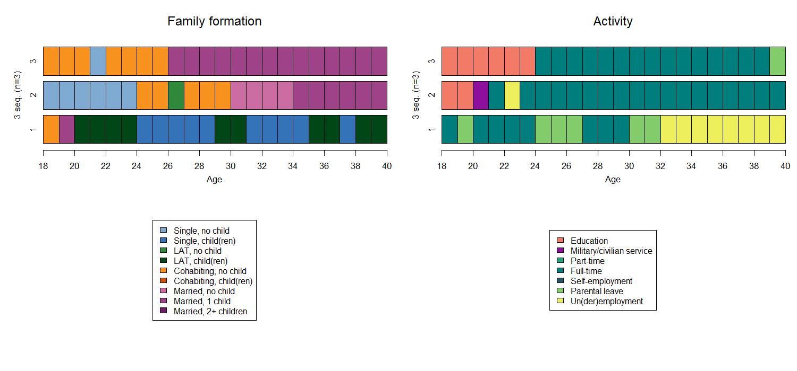

```{r setup, include=FALSE}
knitr::opts_chunk$set(echo = FALSE)

options("kableExtra.html.bsTable" = T)

# load data required for this subchapter
load("data/3-0_ChapterSetup.RData")

# (down)load required packages using pacman
source("source/LoadInstallPackages.R")
```

# Analysing two channels simultaneously

In what follows, we introduce techniques that can be considered if one wants to perform sequence analysis on two channels simultaneously, that is analysisng how two processes jointly unfold over time. In our example, we consider family formation and activity trajectories. We assign different colors to each of the state of the two trajectories.

<p align="center">
{width=100%}
</p>

While we introduce the code and briefly comment on the results here, please refer to the revelant chapter in the book for a discussion on pros and cons of each method.

# Expansion of the alphabet 

The expansion of the alphabet to account for different channels implies that all relevant states for one channel have to be combined with all relevant states of one (or more) other channels. Expanding the alphabet efficiently accounts for the co-occurrence of states  across different domains over time, but can easily result in a very large alphabet of states. An alphabet combining the family and activity trajectories would include 9*7=63 states.


# Multichannel sequence analysis 

As an alternative one can perform a multichannel sequence analysis (MCSA). This strategy consists of computing the dissimilarity between two cases by averaging the substitution and indel costs needed to align the sequences in each channel. The alphabets of the states for the different channels are defined independently of each other, as the choices regarding the substitution and indel costs are independent. The procedure requires the channels to be represented by sequences of the same length, the same time scale (e.g., months or years), and the same temporal window (e.g., from ages 18 to 40)

We calculate the combined pairwise dissimilarity matrix. In this case, we set the indel=1 and the substation=2 for both channels and give equal weight to the two channels (this is done by specifyinf the argument `cweight`). 

The object `fam.year.seq.now` contains sequences for family formation and `act.year.seq.now` for activity trajectories. In this case, the `.now` indicates that we generated the sequences not using weights. 

```{r, eval=TRUE, echo=TRUE}
mcdist_samew <- seqdistmc(channels=list(fam.year.seq.now, act.year.seq.now),
                    method = "OM", indel = 1, sm = "CONSTANT", cweight=c(1,1))

```

The pairwise dissimilarity values for three illustrative sequences in the two channels is 

```{r, eval=TRUE, echo=TRUE}
mcdist_samew[1:3, 1:3]
```

Modifying the argument `cweight`, one can assign more weight to one of the channels: in the following example we assign more weight to the second channel, that is the activity trajectory. This implies that pairwise individuals whose activity trajectories are more dissimilar compare to family formation trajectories will end up having higher dissimilarity compare to individuals who have more dissimilar family formation trajectories. 

```{r, eval=TRUE, echo=TRUE}
mcdist_diffw <- seqdistmc(channels=list(fam.year.seq.now, act.year.seq.now),
                   method = "OM", indel = 1, sm = "CONSTANT", cweight=c(1,2))
```

The pairwise dissimilarity values for three illustrative sequences in the two channels is:

```{r, eval=TRUE, echo=TRUE}
mcdist_diffw[1:3, 1:3]
```

For calculating the Mantel correlation between the two matrices (that is, between the two processes) we first have to transform the two matrices as follows:

```{r, eval=TRUE, echo=TRUE}
fam.om<-as.dist(fam.year.om.now)
act.om<-as.dist(act.year.om.now)
```

We rename the matrices for distinguishing them from the orginal ones. We can then use the function for the Mantel correlation:

```{r, eval=TRUE, echo=TRUE}
manteltest<-mantel.rtest(fam.om, act.om, nrepet = 100)
manteltest
```

# Combine domain-specific dissimilarities

The pairwise dissimilarities are calculated for each channel separately. Before any classification based on the channel-specific dissimilarity matrix, the dissimilarity values for each pair of sequences on all channels can be combined by summation or averaging.

```{r, eval=TRUE, echo=TRUE}
act.year.om.now <- seqdist(act.year.seq.now, method="OM", indel=1, sm= "CONSTANT")
fam.year.om.now <- seqdist(fam.year.seq.now, method="OM", indel=1, sm= "CONSTANT")
```

The pairwise dissimilarity values for three illustrative sequences on each channel is 

```{r, eval=TRUE, echo=TRUE}
  fam.year.om.now[1:3, 1:3]
  act.year.om.now[1:3, 1:3]
```

[summation and averaging of the two matrices in progress]
  